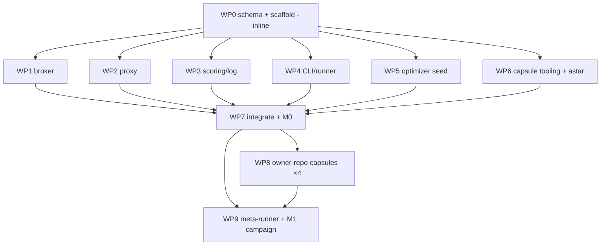

# Hone Build Plan — Seed (M0 → M1)
**Scope:** everything needed to run the first `hone "hone"` campaign and hit the five-point evidence bar. Nothing else. Companion to `hone-rfc-0001-review.md` (Parts VI–VII); RFC section refs are to RFC 0001. **Repo:** `~/hone-full-rewrite` (empty). **Stack:** TypeScript, Node LTS, pnpm workspace, Docker. SQLite deferred (JSONL + CAS). Pi SDK pinned.

* * *
## 1. Deliverables and exit gates
**M0 exit — kernel on one known task:**

- `hone run capsules/seeded-astar` improves the baseline, survives kill+resume (JSONL replay), and `hone best/diff/apply --best/stop --take-best` all work mid-run.
  
- Noise floor published: k=3–5 seed replicates per capsule, σ̂/τ̂ + MDE table auto-generated by the scoring harness.
  
- Proxy metering proven: run halts at budget cap; every session trace lands in CAS.
  

**M1 exit — dogfood loop closed:**

- One bounded `hone "hone"` campaign (20–30 total unique optimizer source artifacts, including the seed arm, each measured across 5 train capsules × 8–12 inner episodes; outer non-seed mutation attempts separately bounded from `candidates - 1` through `4 × candidates`; fixed `gpt-5.6-sol` route for outer and inner mutation) completes headless.
  
- Injected broken + degraded Hone controls, each registered as an exact canonical source-artifact digest + image-bound bundle digest pair, rank below seed (meta-evaluator discrimination).
  
- ≥1 non-seed unique artifact beats seed, sign-consistent on ≥4/5 train capsules; winner diff is an interpretable strategy change (human read); non-regression on the 2 frozen holdout capsules in one terminal access phase; measured cost/admitted candidate makes a 10× campaign conceivable.
  
- Winner seated as improver via champion/challenger with one-command rollback (`apply: none` — owner applies the promotion). The M1 result supports only a **directional, reversible operational promotion** — never a powered corpus-wide causal effect, model-improvement, general-transfer, or recursive-acceleration claim.
  

Any M1 criterion fails → stop, write up which §20 risk fired, revise. No Phase 1–7 investment before the bar passes.

* * *
## 2. Repo shape and frozen interfaces
```text
hone/
├── schema/             # zod schemas + generated types — the ONLY package everyone imports
├── trusted/
│   ├── broker/         # sandbox RPC daemon: sibling containers, quotas, depth caps
│   ├── proxy/          # LLM egress: credential injection, metering, trace capture
│   ├── runner/         # run supervisor: snapshot → episode loop → paired eval → log
│   ├── scoring/        # paired deltas, SE/MDE, noise floor, A-A nulls, promotion rule
│   ├── meta/           # meta-runner: evaluate a candidate hone over K capsules
│   └── cli/            # hone run/best/diff/apply/stop/status, --headless, delivery modes
├── optimizer/          # MUTABLE. episode driver + assets/ (prompt, context policy, parent/restart policy)
└── capsules/           # bootstrap capsules; holdout/ outside optimizer snapshot
```

**Interface freeze (WP0, before any fan-out).** Five contracts, all in `schema/`, all versioned:

1. {==**Capsule manifest** (`manifest.json`): id, objective text, baseline git ref, mutation image, eval entrypoint, asset groups + visibility policy (only `holdout: optimizer-invisible` is law), budget envelope, protected paths, content hashes, `evaluator_source: user|inferred|meta`.==}{>>looks good but rememebr we should try and make the capsule contract as minimal and light as possible; representive of exactly waht is needed to share a 'task'<<}{id="c1" by="user" at="2026-07-15T05:38:31.182Z"}_Minimality rule:_ the required core is exactly what another machine needs to run the task — identity, objective, baseline ref, evaluator entrypoint, asset groups + visibility, budget envelope, hashes. Everything else (provenance, `evaluator_source`, licensing, difficulty labels) lives in an optional `meta` block that can be dropped without breaking replay. A capsule is a shareable task, not a run record.
  
2. **Broker wire protocol** (JSON-RPC over unix socket): `getTask`, `createSandbox`, `exec`, `putFile/getFile`, `saveArtifact`, `evaluate` (idempotent, memoized on optimizer-digest × capsule-digest × seed, returns cost/duration metadata), `reportIncumbent`, `getBudget`, reserved `spawnRun`/`queryCorpus` (NotImplemented). Persistent scratch dir mounted, quota'd, snapshotted.
  
3. **Proxy API**: OpenAI-compatible `/v1/chat/completions`; auth = per-run bearer token minted by the runner; per-role upstream map from run config; hard budget stop; NDJSON trace per request.
  
4. **Event log** (NDJSON, append-only): run/episode/eval/incumbent/budget events; rowid-style cursor so attach, resume, and any future UI/sync read the same stream.
  
5. **Run config / contract**: objective, capsule ref, budget, model routing per role, `apply: none|branch|pr|auto`, headless flag. Contract rendered to `.hone/contract.md`; revisions diffed.
  

Evaluator output = RFC §7.3 JSON **plus** unbounded `per_example[*].feedback` blobs, passed through untouched.

**TDD applies to** `trusted/` **only** (scoring math, broker protocol conformance, budget enforcement, holdout ledger — the honesty kernel earns tests first). `optimizer/` is disposable by design: smoke-tested, not unit-tested; the loop will rewrite it.

* * *
## 3. Work packages
### WP0 — scaffold + schema + interface freeze _(me, inline — prerequisite for all fan-out)_
pnpm workspace, `schema/` package with the five contracts as zod + fixtures, lint/type pipeline, one conformance test per contract. Also: `docs/` gets the review doc + this plan; `.hone-version` pinning + champion/challenger seat file layout.
### Wave 1 — six parallel workers (one `task` batch)
| WP | Package | Builds | Acceptance (per-WP smoke, no global suites) |
|---|---|---|---|
| WP1 | `trusted/broker` | Docker Engine API client; sibling mutation/eval containers (single image, protected assets mounted RO at eval-time only, never to mutation); exec/file ops; quotas + depth caps; scratch-dir lifecycle | conformance test suite over the wire protocol passes against a live local Docker; mutation sandbox demonstrably cannot read a `protected/` fixture |
| WP2 | `trusted/proxy` | OpenAI-compat forward → configurable upstream (vibeproxy `:8317`); per-run token mint; usage metering; hard stop at cap; NDJSON traces to CAS; per-role upstream map | scripted session hits cap mid-stream and gets a clean budget error; trace file replays token counts to the cent |
| WP3 | `trusted/scoring` + event log + CAS | paired per-example deltas, SEs, MDE table, noise-floor report from k replicates, A-A null harness, pre-registered promotion rule (config-frozen at campaign start), holdout query ledger with lifetime budget | golden-file tests on synthetic score sets incl. an A-A run that must NOT pass the promotion rule |
| WP4 | `trusted/cli` + runner skeleton | `hone run` foreground + `--headless` (NDJSON stdout, machine-readable exit report); attach/resume via event cursor; `best/diff/apply/stop --take-best`; delivery modes (`none/branch/pr/auto` — branch/pr via local git only, no push in seed); contract render + approval prompt | kill -9 mid-run, `hone run --resume` continues from the log; `apply --best` lands on a branch without touching the working tree |
| WP5 | `optimizer/` seed | one mutation episode = one Pi session in a mutation sandbox (via broker + proxy only); reflective context assembly (objective, parent evidence, lineage summary, budget); greedy incumbent + ε-restart + one-repair as a ~20-line `assets/policy.ts`; per-example vectors logged | against a stub broker: produces a candidate artifact + episode events; zero imports from `trusted/` internals — schema + wire protocol only |
| WP6 | `capsules/` tooling + first capsule | capsule scaffolder; the `seeded-astar` tier-1 capsule (agent-authored: deliberately slow A* repo, mechanical evaluator = runtime × correctness on train/val/holdout splits); adversarial validator session that authors broken/naive/shortcut candidates; trusted ordering check | ordering check passes: broken < naive < baseline < reference-improved, stable across 3 evaluator invocations |

Cross-WP rule: everyone codes against `schema/` fixtures, nobody blocks on a sibling. Questions about a contract go to me via IRC; if two WPs need a contract change, I amend `schema/` and broadcast — workers never fork the contract locally.
### Wave 2 — integration _(me + targeted spawns)_
- **WP7 — integration + M0** _(me)_: wire runner → broker/proxy/scoring/optimizer; run `seeded-astar` end-to-end; k=3–5 replicate noise floor; A-A null through the full stack; fix seams. A **reviewer** subagent does a security pass on `trusted/` before M0 is called (boundary walk: can mutation reach holdout/credentials/socket? does budget survive process-tree games?).
  
- **WP8 — remaining capsules** _(parallel batch, needs your repos)_: 6 workers author the remaining M1 corpus — from `trade-up-bot` (offline profit-finder with protected knn module → train; `/trade-ups` uncached query latency → holdout), Monoagent context retention (train), FLT TextInput (train), expanded Agentelo scoring (train), and FLT workflow parser (holdout). Each: evaluator + splits + adversarial validation + ordering check, you approve objectives + freeze. 2 capsules → `holdout/`, frozen, ledger-gated. (`tradeup-search-latency` and `site-cold-start` are deferred, not relabelled — no frozen search-latency oracle, no site build entrypoint.)
  
- **WP9 — meta-runner + campaign** _(me)_: `trusted/meta` implements RFC §12.2 (reset → admit a unique canonical candidate source artifact → run its image-bound optimizer bundle headless via broker with fixed inner budget → score on validation → per_example[capsule]); meta-capsule; inject one broken + one degraded Hone control as exact source-artifact + bundle-digest pairs; then launch the M1 campaign under `launch` (long-running, detached), monitor via NDJSON cursor, analyze with the WP3 harness.
  
### Dependency graph


* * *
## 4. Orchestration model — how I run this
- **I** {==**hold the plan, contracts, and integration.** WP0 inline (prerequisites don't parallelize). Then **one** `tasks[]` **batch of six workers** for Wave 1 — each brief carries its frozen interface, acceptance smoke, and "no formatters/linters/global suites" (I run those once at integration). Read-only research that surfaces mid-build (Pi SDK session API details, Docker Engine API quirks, vibeproxy config) goes to **scout/librarian** spawns rather than polluting builder contexts.==}{>>good plan -- feel free to suggest me which models to select for each 'role' of agent you have. i have claude and gpt maybe research recent models<<}{id="c2" by="user" at="2026-07-15T05:39:34.949Z"}
  
- {==**IRC is the contract-change channel.** Workers DM me on interface friction; I arbitrate, patch `schema/`, broadcast. Workers never negotiate contracts pairwise into divergence.==}{>>good plan -- feel free to suggest me which models to select for each 'role' of agent you have. i have claude and gpt maybe research recent models<<}{id="c2" by="user" at="2026-07-15T05:39:34.949Z"}
  
- {==**Reviewer gates where stakes are asymmetric:** a reviewer-agent security pass on `trusted/` before M0 (the honesty kernel is the one thing the loop can't be allowed to route around), and a reviewer diff-read of the M1 winning candidate before you apply the promotion — the council pattern from the review, reused as the autonomy ladder's stage-0 gate.==}{>>good plan -- feel free to suggest me which models to select for each 'role' of agent you have. i have claude and gpt maybe research recent models<<}{id="c2" by="user" at="2026-07-15T05:39:34.949Z"}
  
- {==**The campaign itself runs under** `launch`**,** headless, `apply: auto` on artifact-level inner runs, `apply: none` on the improver seat. I watch the NDJSON cursor, not the process; intervention = stop/rollback via CLI, never mid-state surgery.==}{>>good plan -- feel free to suggest me which models to select for each 'role' of agent you have. i have claude and gpt maybe research recent models<<}{id="c2" by="user" at="2026-07-15T05:39:34.949Z"}
  
- {==**After M1, orchestration inverts:** deferred subsystems (daemon, SQLite, UI, sync) become dogfood objectives — `hone --headless "implement the daemon per RFC §13.1"` piloted by me, reviewed like any candidate. I stay integrator/auditor; hone becomes the builder. Traces tagged `meta: true` accumulate the "hone built itself" record from run one.==}{>>good plan -- feel free to suggest me which models to select for each 'role' of agent you have. i have claude and gpt maybe research recent models<<}{id="c2" by="user" at="2026-07-15T05:39:34.949Z"}
  
- **Fleet model assignments (build phase, my subagents):** builders WP1–6 = **Claude Fable 5** (SWE-bench Verified 95.0 / Pro 80 — strongest multi-file implementation; non-negotiable for the `trusted/` WPs); scouts/librarian lookups = **GPT-5.6 Terra** (fast long-horizon tool use; Haiku 4.5 for cheap fact-finding); reviewer gates = **GPT-5.6 Sol, max reasoning — deliberately cross-family from the Claude builders** (review IV.3's error-independence principle applied to the build itself: the security pass and winner diff-read must not share the implementer's blind spots); adversarial validator in capsule authoring = cross-family from whichever model authored that evaluator.
  

* * *
## 5. Bootstrap capsules
M1 corpus — **5 public train + 2 frozen holdout** (resolves the earlier 3-train vs 4/5 sign-gate contradiction):

| # | Capsule | Objective | Evaluator (mechanical) | Split | Notes |
|---|---|---|---|---|---|
| 1 | `seeded-astar` | make pathfinder fast, keep correctness | trusted correctness/performance aggregate (runtime median-of-k × test pass) | train | tier-1, first smoke + noise-floor target |
| 2 | `tradeup-profit` | find more profitable tradeups; **knn-pricing module protected** | top-K distinct valid-signature net profit on sealed market snapshots | train | protected-path probe = free exploit-resistance signal |
| 3 | `monoagent-context-retention` | retain more registered record utility under `maxWindowChars` | weighted recall of valid unique structured records at the char cap | train | open structured-utility search; no model call |
| 4 | `flt-textinput` | pass the sealed TextInput case bank | passed / declared sealed cases (41+ plus hidden Unicode/escape/state variants) | train | bounded state-machine calibration |
| 5 | `agentelo-scoring` | classify no-diff / infrastructure / precedence / dedup correctly | passed / declared sealed cases over a sealed log/precedence bank | train | bounded classification calibration |
| 6 | `tradeup-query-latency` | faster `/trade-ups` uncached search | p50/p95 query ms on fixture DB under an identical response hash | holdout | frozen pre-campaign, withheld from all outer feedback |
| 7 | `flt-workflow-parser` | parse legacy/DAG/gate/reference/preset structural variants | passed / declared sealed structural cases | holdout | frozen pre-campaign, withheld from all outer feedback |

`tradeup-search-latency` and `site-cold-start` are deferred, not relabelled.

{==All perf metrics: pinned CPU quotas + median-of-k (macOS VM noise; campaign box should be Linux if available — decide at WP7). You approve each objective/contract; agents author everything else; holdouts freeze before the first outer candidate is generated.==}{>>my mac is a decently strong machine so do not fear + we can provison cloud resources for money, no problem. budget should not be too much of your concern at all, same with time<<}{id="c3" by="user" at="2026-07-15T05:40:16.314Z"}

Compute and budget are not binding constraints (owner: cloud provisioning available, strong local machine). Quota-pinning and median-of-k stay regardless — they buy determinism, not thrift. Provision a Linux box for the campaign at WP9 time.

* * *
## 6. Models, routing, cost
- **Routing (per-role, in run config; frozen for the M1 campaign):** M1 fixed route = `gpt-5.6-sol` for **both** outer and inner mutation roles (route verified live: HTTP 200, response model `gpt-5.6-sol`; seed and candidates re-baselined under it — M0's GLM scores are not pooled); evaluator-author = `gpt-5.6-sol`; adversarial validator = cross-family where accessible (error independence per review IV.3), else `luna`. Grounding: Sol leads Terminal-Bench 2.1 (88.8) and AA Coding Agent Index (80) with lower output-token burn; Terra close behind (87.4) at the balanced tier — long-horizon terminal work is the nearest proxy to a mutation episode. {==First routing ablation (Terra vs cheap alt on inner) is an early dogfood objective, not a debate.==}{>>yes good maybe something like glm 5.2 or 5.1 or even gpt 5.5/4/3-codex/etc could be good;<<}{id="c4" by="user" at="2026-07-15T05:41:09.447Z"}
  
  - Inner-model ablation candidates (in priority order, subscription/openweight-cheap first): `gpt-5.6-luna`, GPT-5.5, GLM-5.2 (statistically tied with Opus 4.8 on some quality benchmarks at lower cost/task), GLM-5.1, GPT-5.4/codex-class. The ablation is a capsule: same train tasks, same budget, routing as the only variable — the loop scores it like anything else.
    
- **Chain:** mutation container → hone-proxy (meter + record) → vibeproxy `:8317` (account rotation, resets) → provider. Marginal dollars ≈ 0; budget accounting still runs in tokens + wall-clock because the trusted meter is the recursion guard, not a billing feature.
  
- **Campaign sizing:** 600–900 sessions over 2–4 days; schedule waves around rate-limit reset windows; memoization makes candidate re-scores free.
  

* * *
## 7. Build risks
- **Pi SDK unknowns** (session API, tool injection, base-URL override): scout dispatched at WP0 time; if the SDK fights the sandbox model, fallback is structured subprocess wrapper (RFC §10.1 allows it).
  
- **Docker/macOS:** copy sources into containers (VirtioFS penalty), image GC from day one; perf capsules pinned + median-of-k or moved to a Linux box.
  
- **Task fixtures.** [Historical private capture instructions omitted.] Preserve immutable fixture data and recorded hashes.
  
  - Fixture data must support deterministic replay. [Historical private infrastructure and access handoff omitted.]
    
- **Scope creep:** anything not on the M0/M1 exit lists is a post-M1 dogfood objective by default.
  

**Sequence (attention schedule, not calendar):**

1. **Auto (me):** WP0 → Wave 1 batch → WP7 integration → M0 evidence + cross-family security pass. No user attention needed.
  
2. [Historical private infrastructure access question omitted.]
  
3. **Auto (me + fleet):** WP8 capsule authoring + ordering checks → holdout freeze → WP9 meta-runner + negative controls → M1 campaign launched headless; I watch the event cursor.
  
4. **You (one focused session):** M1 evidence review against the five-point bar · winner diff-read alongside the cross-family reviewer · apply the improver promotion (`apply: none` — your hand on the seat).
  
5. **Auto thereafter:** post-M1 dogfood objectives (daemon, SQLite, UI, …) run headless with reviewer gates; you're paged only at promotion points, until the autonomy-ladder criteria retire even those pages.
