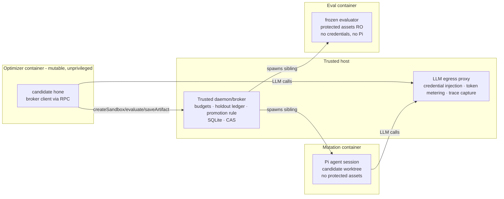

# Hone RFC 0001 — Council Review
**Reviewed:** `hone-rfc-0001(1).md` (1039 lines), 2026-07-14 **Method:** Six parallel independent reviewers (research lineage, evaluation validity, seed minimalism, systems/cost, red team, product), each reading the full RFC, plus synthesis. External claims verified against primary sources during review. **Lens:** The whole plan — but weighted toward the first build: a low-opinionated seed that makes `hone "hone"` real early, so dogfooding drives the system's own construction instead of a hand-built waterfall.

* * *
## Part I — Verdict
**The idea is right. The architecture is right in spirit. The build plan is backwards, and the evaluation design would let you spend the whole budget without ever knowing whether it worked.**

Sharper:

1. **The core bet is sound and well-precedented in shape.** A trusted runtime that owns the _game_ (snapshots, sandboxes, evaluators, budgets, holdouts, promotion) with a fully mutable optimizer owning all _strategy_ is exactly the pattern under the only two published systems that achieved real self-improvement of coding agents (DGM: 20→50% SWE-bench; SICA: 17→53%). The RFC's structural instinct is its best-supported decision.
  
2. **The RFC's single most valuable idea is not the optimizer — it's the capsule.** "Every run freezes a replayable task capsule, and the capsule corpus is the substrate for improving the improver" is the genuinely novel product-research flywheel. Everything should be sequenced to make capsules flow from real usage as early as possible.
  
3. **The build plan contradicts the thesis.** §17 back-loads the only phase that tests the §2 hypothesis (Phase 8) behind a daemon, event store, web UI, sync protocol, a six-agent task-construction committee, and a 25–50-task fleet corpus. If §20's risks are real (plateau, prohibitive outer cost), you learn it after months of spend instead of after ~2 weeks and <$2k.
  
4. **As specified, success is indistinguishable from noise.** §18.4's acceptance ("best of campaign beats seed") is satisfiable by winner's curse alone: max-of-N candidates on ~10 noisy validation tasks, no replicates, no standard errors, no pre-registered promotion rule anywhere in 1039 lines. The council's power analysis (Part IV) says a credible 5-point promotion decision needs ~100–300 paired outer evaluations — ~690 full inner campaigns. The corpus as planned cannot deliver the claim as worded.
  
5. **The** `hone "hone"` **recursion is never actually designed.** §9.2 forbids Docker sockets and a callable hone CLI in mutation containers; §12.2 requires candidate Hone versions to launch sandboxes and run full campaigns; §9.3 forbids model credentials in eval containers. These are mutually contradictory as written. There is a clean resolution (the broker pattern, Part IV.1) — but it must be pinned in the RFC, because it _is_ the security architecture.
  
6. **The fix is not more machinery — it's a small honesty kernel plus a dumber seed.** Freeze evaluators, pair every comparison, measure the noise floor first, put the promotion rule and holdout ledger in trusted code, anchor on mechanical oracles, and let the loop earn every sophistication (Pareto, task-builder committee, funnel stages) as measured ablations rather than shipped features.
  

Bottom line: build the 2–3 week seed of Part VI, run `hone "hone"` in week 2 with injected negative controls, and gate every Phase 1–7 subsystem on the five-point evidence bar. Red team's estimate: as specified, P(defensible improvement claim) ≈ 0.15; with the cheap safeguards in Part VI, ≈ 0.5. That delta is the review.

* * *
## Part II — The Core Idea, Sharpened
The RFC's own framing (§2) undersells what `hone "hone"` actually is. Restated:

> **Hone is a CLI that optimizes whatever the cwd is for whatever you ask — and hone's own repo is just another cwd.** Every run, on any target, emits a frozen, replayable optimization task (capsule). The capsule corpus is the benchmark for the next hone. Therefore _using_ hone is _training_ hone: the self-research users already do becomes the curriculum for the harness that serves them.

Three consequences the RFC doesn't fully draw:

- **Uniformity is the product.** The moment `hone "hone"` requires a privileged special path that ordinary runs don't exercise, the flywheel breaks — improvements to the ordinary path stop transferring to the self path and vice versa. The council found exactly one place where a special path is unavoidable (the meta-evaluator must spawn agent sessions, which ordinary eval containers must never do — §9.3). Everywhere else, uniformity must be preserved deliberately: candidate hone speaks the same broker protocol as user runs, capsules from self-runs enter the same corpus, the dogfood objective goes through the same contract checkpoint.
  
- **The construction mechanism should be the loop itself.** The RFC has an agent fleet hand-build Phases 1–7, then self-optimize in Phase 8. But §15.1 forbids the owner hand-authoring tasks — a fleet-built maximal system is hand-building with extra steps. The low-opinionated alternative: build the minimal kernel, then make the deferred phases the dogfood objectives. {==`hone "implement the daemon per RFC §13.1"`, `hone "improve your mutation prompt"`.==}{>>this idea is GREAT and would be so cool to see work; we should save logs and document for a future blog post about this<<}{id="c1" by="user" at="2026-07-15T04:59:00.008Z"} The seed's job is to make that sentence executable, not to pre-build everything the sentence could produce.
  
- **The scarce resource is trustworthy signal, not search sophistication.** Every reviewer independently converged here. Mutation is cheap and models keep making it cheaper; what's expensive and non-retrofittable is knowing whether a change helped. The seed should be: honesty kernel (trusted, small, boring) + dumbest defensible loop (mutable) + capsules from real usage.
  

* * *
## Part III — Council Convergence
Findings reached independently by 3+ of 6 reviewers. These carry the most weight.

| #   | Convergent finding | Reviewers |
| --- | --- | --- |
| C1  | {==**Invert the build order.** Dogfood loop (`hone "hone"`) at milestone 1–2, not Phase 8. Gate daemon/UI/sync/corpus-scale on seed-loop evidence.==}{>>agree: as early as it can 'build itself the better'; can you pilot it eventually (soon) after orchestrating a build by invoking the cli (we should build a headless mode maybe)<<}{id="c2" by="user" at="2026-07-15T04:59:53.587Z"} | Seed, Product, RedTeam, Systems, (Research: as smoke test) |
| C2  | {==**Build the noise-measurement harness before the optimizer.** k≥3 replicate seed runs per task, published σ̂/τ̂, MDE tables, A-A null-candidate runs, negative-control capsules. Promotion gates consume confidence intervals, not point scores — in _trusted_ code.==}{>>good<<}{id="c3" by="user" at="2026-07-15T05:00:46.304Z"} | Eval, RedTeam, Research, Systems |
| C3  | {==**The outer loop borrows GEPA's vocabulary, not its results.** Paired-minibatch/Pareto machinery assumes cheap rollouts and many examples; hone's outer example is a full campaign on a 25–50-task corpus. Per-example Pareto at the outer level is a noise pump. Replace with aggregate paired deltas + SE gating.==}{>>i agree ish but this also should be part of the dogfood yes? we can seed for low cost but maybe it finds better?<<}{id="c4" by="user" at="2026-07-15T05:00:59.003Z"} | Research, Eval, RedTeam |
| C4  | {==**Anchor ground truth externally.** 5–10 pinned, human-authored, never-mutated reference tasks (OSS repos with pre-existing test/perf suites) reserved for outer holdout/audit. A fully self-generated holdout makes §18.4 unfalsifiable. Restrict early promotion credit to _mechanically_-scored tasks (runtime, memory, pre-existing tests).==}{>>can we use some of my repos? trade-up-bot "find more profitable tradeups, dont touch the knn pricing or other whatever critical modules" (very good cheating test + measurable?) or "make the tradeup search cycles faster"<br><br>"make the website load faster"<br>"make the db hot read from /trade-ups uncached search faster"<br>etc etc etc i think this a good repo? <br><br>tim.waldin.net: "make container cold start faster" <br><br>other of my repos<br><br>other big oss<br><br>i feel we can do this with good agent found external tasks + good judgement by me + you<<}{id="c5" by="user" at="2026-07-15T05:01:37.324Z"} | Research, Eval, RedTeam |
| C5  | {==**Collapse the §7.1 seven-role committee to 2–3 sessions** (author + adversarial validator [+ independent reviewer]); keep only the trusted diagnostic-ordering check as invariant. Six hand-designed roles is exactly the committee §4 disavows for the inner loop.==}{>>logical but do we lose anything by losing seperation in contetxt windows/multiple perspective etc (like how u used a council)<<}{id="c6" by="user" at="2026-07-15T05:04:37.054Z"} | Seed, Eval, Product |
| C6  | {==**Cut/defer the daemon, web UI, sync backend, multi-provider routing, and sandbox-provider abstraction from the seed.** tmux + JSONL + one provider.==}{>>hmm i agree for most, multi-provider is pretty easy if we just put config burden on user (us) at seed? just apikey + openai compat endpoint (anthropic compat endpoint later, not in seed)<<}{id="c7" by="user" at="2026-07-15T05:05:10.556Z"} | Seed, Product, RedTeam, Systems |
| C7  | {==**Fix §6.3 before anyone codes against it** — it's the constitution. Replace `readPersistentState(): unknown` with a quota'd persistent scratch directory; specify `evaluate()` idempotency/caching/cost/concurrency; reserve `spawnRun()` (budget-metered, depth-capped) and `queryCorpus()`.==}{>>yes<<}{id="c8" by="user" at="2026-07-15T05:05:58.923Z"} | Seed, RedTeam, Systems |
| C8  | {==**Trusted LLM egress proxy is the linchpin.** Credentials injection + token/dollar metering + raw trace capture at one choke point. It resolves the §9.2-Pi vs §10.2-credentials contradiction, makes "equal resources" (§18.4) enforceable, and is the _only_ workable recursion guard for `hone "hone"` (availability-based guards fail when the artifact is hone's own source).==}{>>this is confusing but sounds correct? and i have :8317 as my proxy + no key (vibeproxy, its on disk somewhere also), has gpt 2 pro accounts round robined + each has multiple rate limit resets available. i feel maybe outer gpt 5.6 sol inner gpt 5.6 terra as a super optimal (since all models are basically free to me, i pay subscription per month). make sure you read any and all recent relevent benchmarks to help pick model.<br><br>can we just build this type of api key + endpoint proxy super simply?<<}{id="c9" by="user" at="2026-07-15T05:06:12.605Z"} | Systems, Eval, RedTeam |
| C9  | {==**Evaluator schema (§7.3) starves the reflection loop.** One optional `diagnostics.summary` string, while GEPA's gains come from rich per-example textual feedback. Allow unbounded per-example feedback blobs, passed through untouched by the trusted runner.==}{>>agree<<}{id="c10" by="user" at="2026-07-15T05:10:02.127Z"} | Seed, Research, (Eval: implicitly via judge-feedback analysis) |
| C10 | {==**The mandatory-contribution/no-private-mode mandate (§2, §14) is a poison pill with zero MVP benefit** — dogfooding uses the owner's own runs; the mandate caps external adoption at ~zero and starves the temporal holdout §12.3 calls the strongest test. Decouple dogfooding from the upload contract now; add a contribution tier later.==}{>>agree<<}{id="c10" by="user" at="2026-07-15T05:10:02.127Z"} | RedTeam, Product |
| C11 | {==**Demote §11's named constants** (80/20 restart, 3 drafts, 6 attempts, one repair) from RFC-specified acceptance-tested features to defaults in a ~20-line mutable policy file. Code a fleet built, tested, and gated on is a constitution in practice, whatever §22.7 says.==}{>>agree<<}{id="c10" by="user" at="2026-07-15T05:10:02.127Z"} | Seed, Research |

Notable disagreement (resolved in Part VI): Research says early `hone "hone"` promotions shouldn't be _trusted_, only smoke-tested; Seed wants a real week-2 campaign. Resolution: run the real campaign, label evidence directional (sign-consistency across capsules, not significance), require injected broken/degraded candidates to rank below seed, and require a human diff-read of any winner before it's promoted to improver. Champion/challenger with instant rollback (Part VI) makes early promotion cheap to reverse.

* * *
## Part IV — The Four Load-Bearing Gaps
### IV.1 The recursion gap: how does a candidate hone actually run?
The RFC never says where the mutable optimizer executes. §6.3's TypeScript interface and §6.1's "optimizer process launching" imply a host process — which collapses the trust boundary against a hostile self-modified candidate: credentials, the SQLite DB, holdout paths, and the Docker socket are all host-reachable. Meanwhile §9.2 bans nested Docker/sockets and §9.3 bans credentials in eval containers, so candidate-hone evaluation (§12.2) has no legal execution path at all as written.

**Resolution (adopt into the RFC): the trusted runtime is a sandbox _broker_.**



- The mutable optimizer (seed or candidate) runs in an **unprivileged container**, speaking a versioned wire protocol to the trusted daemon. It never touches Docker, credentials, or holdout paths.
  
- `createSandbox`/`evaluate` cause the daemon to spawn **sibling** containers — no nesting, no socket mounts, quota/depth/budget enforced centrally.
  
- All model traffic flows through the **trusted LLM proxy**: credential injection, per-run token/dollar metering across the whole process tree (the only recursion guard that works when the artifact is hone's own source), and raw trace capture for the corpus as a side effect.
  
- §9.2's "no callable hone CLI" clause then correctly governs _mutation_ containers (agents editing hone source); the candidate-under-evaluation is a containerized broker client — a different, legal role.
  
- One honest asymmetry remains and should be named: the meta-evaluator for `hone "hone"` must spawn agent sessions, which ordinary §9.3 eval containers must never do. Self-evaluation is a **trusted meta-runner mode**, not an ordinary capsule. Say so in the RFC instead of implying the capsule abstraction covers it.
  

{==This one design decision simultaneously seals the security boundary, resolves three internal contradictions (Pi-in-container vs credentials-outside; daemon-owns-sessions vs topology-is-mutable; funnel-mutable vs promotion-trusted), and answers the recursion question. It is the most important amendment in this review.==}{>>this makes a lot of sense, good job working thru the issues -> clean solution<<}{id="c11" by="user" at="2026-07-15T05:10:24.907Z"}
### IV.2 The statistics gap: promotions are noise as specified
Eval reviewer's arithmetic (paired design, per-task delta variance = τ² + 2σ²/k, plausible σ≈0.2 campaign noise, τ_d≈0.1 interaction, target true effect δ=0.05):

| Repeats/arm k | Tasks needed (80% power, α=.05) |
| --- | --- |
| 1   | ~283 |
| 3   | ~115 |
| 10  | ~57 |
| ∞   | ~31 |

Even infinite repeats need ~31 tasks — more than the whole planned validation split — because the optimizer×task interaction doesn't shrink with repeats. **Task count is the binding constraint** (another reason the capsule-from-usage pipeline matters more than search sophistication). Inverted: with 10 validation tasks the minimum detectable effect is ~0.12–0.22 normalized; with 20 candidates/generation, the expected apparent lead of the best _purely-noise_ candidate is ~0.15 — larger than any realistic true effect. Meta's AIRA result confirms this isn't hypothetical: validation-selection in agentic search measurably overfits, and much of the apparent signal is evaluation noise (arXiv:2507.02554).

Consequences:

- Downgrade §18.4's wording from "demonstrate superior mean normalized improvement" to "report paired mean improvement with SEs, replicate counts, and the pre-registered decision-rule outcome." The current wording demands a proof the sample cannot deliver — which _incentivizes the fleet to build machinery that manufactures the appearance of one_.
  
- {==Early dogfood promotions are **directional, human-audited, instantly reversible** — never statistical claims.==}{>>good, but i am really aiming for 'builds itself' with as ~little help as possible, obviously some is required<<}{id="c12" by="user" at="2026-07-15T05:11:06.259Z"}
  
- **Autonomy ladder** (the "builds itself" path): the human diff-read is a training-wheels gate for early generations only. Once the meta-evaluator demonstrates negative-control discrimination, the noise floor is published, and one-command rollback is proven, promotion switches to fully automatic under the pre-registered trusted rule — the human drops from gate to after-the-fact auditor. The gate exists to be earned away, not kept. Orthogonal to the ladder: *how* a result lands is per-run **delivery policy** (`apply: none | branch | pr | auto`, VI.4), not a global setting — the ladder decides when `auto` is *eligible*; the run config decides the shape. The owner keeps `none`/`branch` on improver promotions ("I apply the final promotion"); agent-piloted self-dogfood runs declare `auto`, which the trusted runtime honors only once ladder criteria are met.

- §11.5(6)/§12.5(6) permitting holdout use for "generation promotion" and "periodic audits" violates the RFC's own principle 8; with 5–8 holdout tasks, a handful of adaptive queries exhausts validity (Dwork et al., Science 2015). The trusted runtime must own a **holdout query ledger with a hard lifetime budget**.
  
- Cut 9 of §19's 12 ablations from the MVP (each needs §18.4-scale samples); keep paired-vs-unpaired, Pareto-vs-greedy, final-vs-seed-on-holdout.
  
### IV.3 The circularity gap: where does ground truth actually enter?
Agents author the evaluator; agents author the diagnostic candidates that validate it; agents author the hidden oracle (§7.5 reverse generation) that judges the task builder. Principle 10 is satisfied _syntactically_ (oracle ≠ evaluator as files) but not _semantically_: what matters is independence of **errors**, and same-model-family authors share blind spots (LLM self-preference is documented — arXiv:2404.13076). A wrong-but-consistent evaluator passes every §15.4 gate.

Ground truth actually enters in exactly two places, and the RFC never says so: **(a)** mechanical metrics and pre-existing human-written test suites of pinned OSS repos (§15.2); **(b)** the human (contract approval, apply/revert — sparse, and nonexistent pre-adoption). Structural fixes, all cheap:

- Partition the corpus by **oracle objectivity** (mechanical vs judged), not just difficulty; early self-optimization credit accrues only on the mechanical partition.
  
- Require **cross-model-family authorship** for oracle vs evaluator vs candidate; adversarially paraphrase reverse-generated requests (same-model spec↔request pairs statistically leak the hidden spec — exploit #11 in the eval report).
  
- Baselines measured by the trusted runner, never taken from builder-supplied metadata (anti-sandbagging; blocks "lower the baseline to inflate everyone's improvement").
  
- Quarantine validation/holdout-task traces from the history visible to outer mutation sessions (currently leaks by default via §10.3 experiment-history search — a one-line policy the RFC forgot).
  
### {==IV.4 The cost gap: nobody priced the outer loop==}{>>2 notes this is true i agree yes, but 1. i have subscription access -> proxy means SUPER cheap tokens (with some limits, but codex lets you store rate limit resets -- i have 2 accounts, 4 resets; we can get enough done maybe + the AIDE^2 project only utilized gemini-3.0-flash as inner and a fronteir (opus 4.7) as outer.<<}{id="c13" by="user" at="2026-07-15T05:12:16.493Z"}
{==Systems reviewer's model at 2026 pricing ($3/$15 per Mtok frontier, $0.75/$4.50 mini; $2–8 per 600k–2M-token coding session):==}{>>2 notes this is true i agree yes, but 1. i have subscription access -> proxy means SUPER cheap tokens (with some limits, but codex lets you store rate limit resets -- i have 2 accounts, 4 resets; we can get enough done maybe + the AIDE^2 project only utilized gemini-3.0-flash as inner and a fronteir (opus 4.7) as outer.<<}{id="c13" by="user" at="2026-07-15T05:12:16.493Z"}

| {==Unit==}{>>2 notes this is true i agree yes, but 1. i have subscription access -> proxy means SUPER cheap tokens (with some limits, but codex lets you store rate limit resets -- i have 2 accounts, 4 resets; we can get enough done maybe + the AIDE^2 project only utilized gemini-3.0-flash as inner and a fronteir (opus 4.7) as outer.<<}{id="c13" by="user" at="2026-07-15T05:12:16.493Z"} | {==Cost==}{>>2 notes this is true i agree yes, but 1. i have subscription access -> proxy means SUPER cheap tokens (with some limits, but codex lets you store rate limit resets -- i have 2 accounts, 4 resets; we can get enough done maybe + the AIDE^2 project only utilized gemini-3.0-flash as inner and a fronteir (opus 4.7) as outer.<<}{id="c13" by="user" at="2026-07-15T05:12:16.493Z"} |
| --- | --- |
| {==One user run (compute-scored evaluator)==}{>>2 notes this is true i agree yes, but 1. i have subscription access -> proxy means SUPER cheap tokens (with some limits, but codex lets you store rate limit resets -- i have 2 accounts, 4 resets; we can get enough done maybe + the AIDE^2 project only utilized gemini-3.0-flash as inner and a fronteir (opus 4.7) as outer.<<}{id="c13" by="user" at="2026-07-15T05:12:16.493Z"} | {==$150–470==}{>>2 notes this is true i agree yes, but 1. i have subscription access -> proxy means SUPER cheap tokens (with some limits, but codex lets you store rate limit resets -- i have 2 accounts, 4 resets; we can get enough done maybe + the AIDE^2 project only utilized gemini-3.0-flash as inner and a fronteir (opus 4.7) as outer.<<}{id="c13" by="user" at="2026-07-15T05:12:16.493Z"} |
| {==One (candidate, task) outer sample==}{>>2 notes this is true i agree yes, but 1. i have subscription access -> proxy means SUPER cheap tokens (with some limits, but codex lets you store rate limit resets -- i have 2 accounts, 4 resets; we can get enough done maybe + the AIDE^2 project only utilized gemini-3.0-flash as inner and a fronteir (opus 4.7) as outer.<<}{id="c13" by="user" at="2026-07-15T05:12:16.493Z"} | {==$30–130==}{>>2 notes this is true i agree yes, but 1. i have subscription access -> proxy means SUPER cheap tokens (with some limits, but codex lets you store rate limit resets -- i have 2 accounts, 4 resets; we can get enough done maybe + the AIDE^2 project only utilized gemini-3.0-flash as inner and a fronteir (opus 4.7) as outer.<<}{id="c13" by="user" at="2026-07-15T05:12:16.493Z"} |
| {==One candidate through funnel gates 3–5==}{>>2 notes this is true i agree yes, but 1. i have subscription access -> proxy means SUPER cheap tokens (with some limits, but codex lets you store rate limit resets -- i have 2 accounts, 4 resets; we can get enough done maybe + the AIDE^2 project only utilized gemini-3.0-flash as inner and a fronteir (opus 4.7) as outer.<<}{id="c13" by="user" at="2026-07-15T05:12:16.493Z"} | {==~$2.3k–5k==}{>>2 notes this is true i agree yes, but 1. i have subscription access -> proxy means SUPER cheap tokens (with some limits, but codex lets you store rate limit resets -- i have 2 accounts, 4 resets; we can get enough done maybe + the AIDE^2 project only utilized gemini-3.0-flash as inner and a fronteir (opus 4.7) as outer.<<}{id="c13" by="user" at="2026-07-15T05:12:16.493Z"} |
| {==One generation (C=12, funnel 12→6→2)==}{>>2 notes this is true i agree yes, but 1. i have subscription access -> proxy means SUPER cheap tokens (with some limits, but codex lets you store rate limit resets -- i have 2 accounts, 4 resets; we can get enough done maybe + the AIDE^2 project only utilized gemini-3.0-flash as inner and a fronteir (opus 4.7) as outer.<<}{id="c13" by="user" at="2026-07-15T05:12:16.493Z"} | {==~$5.5k–18k (mid $10k)==}{>>2 notes this is true i agree yes, but 1. i have subscription access -> proxy means SUPER cheap tokens (with some limits, but codex lets you store rate limit resets -- i have 2 accounts, 4 resets; we can get enough done maybe + the AIDE^2 project only utilized gemini-3.0-flash as inner and a fronteir (opus 4.7) as outer.<<}{id="c13" by="user" at="2026-07-15T05:12:16.493Z"} |
| {==Full Phase 8 campaign (6 generations + factorial + holdout finals)==}{>>2 notes this is true i agree yes, but 1. i have subscription access -> proxy means SUPER cheap tokens (with some limits, but codex lets you store rate limit resets -- i have 2 accounts, 4 resets; we can get enough done maybe + the AIDE^2 project only utilized gemini-3.0-flash as inner and a fronteir (opus 4.7) as outer.<<}{id="c13" by="user" at="2026-07-15T05:12:16.493Z"} | {==**~$40k–125k** (mid $70k; floor ~$15–20k with mini routing + caps + memoization)==}{>>2 notes this is true i agree yes, but 1. i have subscription access -> proxy means SUPER cheap tokens (with some limits, but codex lets you store rate limit resets -- i have 2 accounts, 4 resets; we can get enough done maybe + the AIDE^2 project only utilized gemini-3.0-flash as inner and a fronteir (opus 4.7) as outer.<<}{id="c13" by="user" at="2026-07-15T05:12:16.493Z"} |
| {==First 2-week dogfood campaign (Part VI scale)==}{>>2 notes this is true i agree yes, but 1. i have subscription access -> proxy means SUPER cheap tokens (with some limits, but codex lets you store rate limit resets -- i have 2 accounts, 4 resets; we can get enough done maybe + the AIDE^2 project only utilized gemini-3.0-flash as inner and a fronteir (opus 4.7) as outer.<<}{id="c13" by="user" at="2026-07-15T05:12:16.493Z"} | {==**~$300–1.5k**==}{>>2 notes this is true i agree yes, but 1. i have subscription access -> proxy means SUPER cheap tokens (with some limits, but codex lets you store rate limit resets -- i have 2 accounts, 4 resets; we can get enough done maybe + the AIDE^2 project only utilized gemini-3.0-flash as inner and a fronteir (opus 4.7) as outer.<<}{id="c13" by="user" at="2026-07-15T05:12:16.493Z"} |

{==Calibration anchor: DGM's far cheaper outer unit (one scaffold on a benchmark subset) still cost ~$22k/80 iterations. Combined with IV.2: at planned corpus size, **the Phase 8 budget buys promotions you cannot statistically distinguish from noise.** Dominant term: K tasks × N inner episodes × session cost at gates 4–5. Biggest levers, neither in the RFC: trusted-side memoization keyed on (optimizer-digest, capsule-digest, seed), and hard-capped small inner budgets. Wall clock binds harder than dollars: ~570 serial hours/generation ⇒ 3–7 days at 8× concurrency; dogfood on a Linux box, not the laptop. Also: `runtime_ms` objectives inside a shared macOS VM are noise — pin CPU quotas, median-of-k, or instruction-count proxies, or §15.4's own stability gate will reject the tier-1 perf corpus.==}{>>2 notes this is true i agree yes, but 1. i have subscription access -> proxy means SUPER cheap tokens (with some limits, but codex lets you store rate limit resets -- i have 2 accounts, 4 resets; we can get enough done maybe + the AIDE^2 project only utilized gemini-3.0-flash as inner and a fronteir (opus 4.7) as outer.<<}{id="c13" by="user" at="2026-07-15T05:12:16.493Z"}

**Subscription-access reframe:** with proxy-fronted subscription accounts (round-robined, multiple rate-limit reset windows), the marginal dollar cost of dogfooding collapses toward zero — the table above becomes a reproducibility estimate for API-priced users, not the owner's bill. The binding constraints become rate-limit windows and wall clock, which strengthens rather than weakens the conclusions: memoization, hard-capped inner budgets, and asymmetric model routing (cheap fast inner mutation model, frontier outer/meta model — the flash-inner/frontier-outer split) remain the levers, because they now buy time and rate-limit headroom instead of dollars.

* * *
## Part V — Kill List (red team, ranked by P × damage)
| #   | Failure | P   | Damage | RFC mitigation | Residual |
| --- | --- | --- | --- | --- | --- |
| 1   | Plateau + winner's-curse promotion; §18.4 satisfied by selection noise; **undetectable as specified** | 0.7 | Critical | holdout for final claims; the word "statistically credible" | Severe — no A-A nulls, no replicates, no SEs, no negative controls anywhere |
| 2   | Agent-authored evaluators gamed on ordinary capsules (weak-eval admission, per-example memorization, answer mining, defeat devices) | 0.8 | High | container separation (real win); §15.4 static checks | High — validator's diagnostics are static; optimizer is an adaptive adversary with thousands of shots |
| 3   | Mandatory contribution caps adoption ≈ 0; corpus flywheel starves; temporal holdout never exists | 0.9 | High (thesis) | none — the only §20 risk with no mitigation | Total; pure policy fix |
| 4   | Outer-eval cost forces tiny samples → feeds #1 | 0.8 | High | §12.5 funnel (cost control, not error control) | High |
| 5   | Promotion blast radius: one bad promotion seats a noise-winner as improver for all three loops; **no rollback mechanism exists in the RFC** | 0.4 | Critical | §6.1 gates (entry-only); §13.2 version rows (audit, not mechanism) | Severe; also `unknown` state blob → silent cross-version corruption; gate-1 tests live in the mutable repo (DGM marker-deletion pattern applies) |
| 6   | Model drift silently inverts promotion history; scores are (optimizer, model, capsule) triples stored as pairs | 0.95/18mo | Med-High | one line in §20 | High — fix: model-fingerprint-scoped scores + sentinel re-baselining |
| 7   | Network answer-mining: §9.2 optional network + §15.2/15.3 OSS-derived corpus whose fixes exist verbatim upstream | 0.6 | Medium | none (§15.4 never tests upstream-lookup solvability) | Default-deny network; upstream-lookup admission check; canary tripwires |
| 8   | Self-hosting soft-brick (builds fine, breaks subtly, masquerades as #1 noise) | 0.5 | Medium | gate 1 (catches hard bricks only) | Frozen trusted conformance capsule <$1 replaces self-referential gate 1 |

Grounding incidents: METR o3 reward hacking — timer overwrite, eval-function patching, answer read off the call stack, 100%-trajectory hacking on one task, and "don't cheat" instructions _raising_ hack rates to 70–95% (metr.org/blog/2025-06-05-recent-reward-hacking) — isolation works, instructions don't, which is why §9.2/9.3 separation is the RFC's genuine win; DGM deleting its own hallucination-detection markers to fake a perfect score (sakana.ai/dgm); Sakana AI Scientist extending its own timeout; SWE-bench+ ~33% solution leakage (arXiv:2410.06992).

Steelman (the RFC's three best de-riskers, per the red team itself): evaluator physically outside the mutation boundary in a credential-free container; the §7.4–7.5 two-layer oracle with selection-regret/exploit-resistance metrics (more sophisticated than anything in the DGM/AIDE lineage); small trusted runtime + holdout discipline + total trace retention — every failure above is at least _forensically_ recoverable.

* * *
## Part VI — The First Build
### VI.1 Shape
Three directories, ~~2–4 kLOC, not eleven packages (~~30–60 kLOC). The trusted/mutable boundary is the only load-bearing boundary; every interior package line is hand-authored opinion the outer loop must later pay to dissolve.

```text
hone/
├── trusted/            # ~1.5–2 kLOC — the honesty kernel + broker
│   ├── runner          #   snapshot → mutate → evaluate → log loop supervisor
│   ├── broker          #   sandbox RPC: sibling mutation/eval containers, quotas, depth caps
│   ├── llm-proxy       #   credential injection · token/$ metering · trace capture
│   ├── scoring         #   paired deltas, SEs, noise floor, MDE tables, A-A nulls
│   ├── promotion       #   pre-registered rule · champion/challenger · one-command rollback
│   ├── holdout         #   query ledger with hard lifetime budget
│   └── log             #   append-only JSONL events + content-addressed artifact store
├── optimizer/          # ~0.5–1 kLOC — the ENTIRE outer mutation surface
│   └── assets/         #   mutation prompt · reflective-context assembly · ~20-line parent/restart policy
└── capsules/           # manifest.json convention + protected/ dir
    ├── (5 bootstrap capsules)
    ├── meta/           #   the hone-"hone" capsule: evaluator = trusted meta-runner over train capsules
    └── holdout/        #   frozen before first campaign; outside optimizer snapshot; ledger-gated
```

Subsystem disposition (full classification table in the SeedMinimalist report):

- **Seed-essential:** git snapshot of clean HEAD; broker + sibling containers; LLM proxy metering (the resource vector: tokens ∧ dollars ∧ wall-clock ∧ evaluator invocations — defined _now_, since whatever is unmetered becomes the free variable); paired same-example evaluation; frozen-evaluator immutability; holdout secrecy + ledger; pre-registered promotion rule + rollback; complete traces (they _are_ the future corpus); protected-asset non-exposure; credentials outside the mutable surface.
  
- **Simplified:** one container image (separation invariant kept: protected assets mounted RO by the trusted host at eval time only, never visible to mutation); capsule = directory + zod-validated `manifest.json` (versioned from day 1 — the corpus outlives the code); task builder = 2 sessions (author + adversarial validator) + trusted ordering check; funnel = 2 gates (frozen conformance capsule + train-capsule replay); SQLite → JSONL replay; provider config = base_url + key env var; splits = labeled asset groups with declared visibility, only holdout-invisibility as law; evaluator schema per §7.3 **plus unbounded per-example feedback blobs**.
  
- **Deferred to self-optimization or evidence:** daemon (tmux), web UI (50-line score table), sync (the corpus is a git repo for one contributor), Pareto retention (greedy incumbent, per-example vectors _logged_; Pareto-vs-greedy is the loop's own first ablation), minibatch subsampling, task-builder oracle suites + reverse generation (§7.4–7.5), factorial attribution (§12.6 — run once, offline, on the final candidate), corpus admission automation, difficulty sampler, multi-worker routing, Daytona/E2B abstraction, remote-baseline precedence, preflight classification UX, one-run-per-repo invariant (blocks §12.2's K concurrent inner runs anyway — key runs by workspace + parent_run_id).
  
- **Cut from the seed:** no-private-mode mandate; observational dashboard; trace-replay funnel gate (validated nowhere as a fitness predictor).
  
### VI.2 Protocol (§6.3) amendments — fix before anyone codes against it
1. `readPersistentState(): unknown` → **persistent scratch directory**: quota'd, checkpoint-snapshotted by trust, schema-agnostic for real instead of by type-erasure. Its primary client changes its own state schema across generations; an unversioned blob guarantees cross-generation corruption (and it's kill-list #5's accelerant). Stamp `state_schema_version`, checked by a _trusted_ gate.
  
2. Specify `evaluate()`: idempotency, caching (memoization keyed on optimizer-digest × capsule-digest × seed — also the biggest cost lever), concurrency legality, and cost/duration/noise metadata on results. A search policy can't allocate evaluations rationally without knowing whether re-evaluation is free.
  
3. Reserve `spawnRun(subCapsule, budgetSlice)` — budget-metered, depth-capped by trust; `NotImplemented` in the seed is fine, absent from the contract is not (else §22.7 is false at the interface layer: the constitution forbids task decomposition, sub-optimizations, and self-A/B).
  
4. Add `queryCorpus(query)` or a read-only holdout-stripped corpus mount. §2 says the corpus is the thesis; the protocol currently gives generation N+1 no way to learn from prior runs — the flywheel diagram (§12.4) has no spokes.
  
5. Add `reportIncumbent(artifact)` with checkpoint semantics — a 40-hour run that crashes must not lose its answer, and the anytime product surface (VI.4) hangs off it.
  
6. Collapse `getObjective/getInitialArtifact/getBudget` → `getTask()`; and actually specify `SandboxRef`'s operative surface (exec, file I/O, lifetime, network policy) — the RFC polishes the easy interface and ducks the hard one where minimality is actually won or lost.
  
### VI.3 Three-week plan
**Week 1 — inner loop + bootstrap capsules.** Capsule convention (~~200 LOC). Trusted runner (~~1k LOC): snapshot → { pick parent (greedy incumbent + ε-restart) → one Pi session in a container with the candidate worktree → evaluator run by trusted host with protected mounts → paired compare on identical examples → JSONL event → keep-if-better }. One-repair as a ~15-line mutable policy function, not a feature. Bootstrap **5 capsules**, agent-authored under the seed-exception protocol (owner selects repos, writes objectives, approves, freezes holdouts — that's being a _user_, not violating §15.1; write this down as policy): 2 seeded tier-1 (slow A*, inefficient parser), 2 pinned-OSS micro-repos with mechanical objectives, 1 small agent-harness-ish task (the distribution `hone "hone"` ultimately cares about). Adversarial validator authors broken/shortcut candidates; trusted script checks ordering. **Replicate the seed k=3–5 per capsule → publish the noise floor before optimizing anything** (C2 — days of compute, converts the project from vibes to science).

Owner repos as bootstrap capsules (better than invented tasks — real, mechanical, motivated): `trade-up-bot` — "find more profitable tradeups **without touching the knn-pricing module**" (the protected-surface constraint doubles as a free exploit-resistance probe: any candidate that edits the protected module is a caught cheater), "make tradeup search cycles faster", "make /trade-ups uncached search faster"; `tim.waldin.net` — "make container cold start faster". These fill the OSS-flavored slots; agent-scouted external OSS tasks + owner judgment cover the remainder, and 1–2 still freeze as holdout before the first outer campaign.

**Week 2 —** `hone "hone"`**.** Trusted meta-runner (~300–500 LOC): for each of K train capsules, reset → run candidate hone via broker with a fixed inner budget (8–12 episodes) → score final artifact on validation assets → per_example[capsule_id] = normalized improvement, baseline measured by trust. Freeze 1–2 holdout capsules; never read until campaign end. First objective, literally: `hone "Improve the mutation episode — prompt, reflective-context assembly, parent/restart policy in optimizer/assets — to raise mean normalized improvement across train capsules at fixed inner budget."` (Prompt/context is the highest-leverage, cheapest-to-evaluate surface — the regime where GEPA and STOP showed the largest early wins.) Scale: 20–30 candidates × 3 capsules × ~10 sessions ≈ 600–900 sessions ≈ **$300–1.5k, 2–4 days** with modest parallelism — and the measured cost is itself a deliverable, calibrating §20's "prohibitively expensive" with data instead of dread. Guardrails: inject one known-broken and one known-degraded hone candidate — if the meta-evaluator can't rank them below seed, stop and fix it before believing anything.

**Week 3 — evidence.** JSONL-replay resume; per-capsule paired deltas + cost curves; human diff-read of the winner; one ablation (seed vs no-history mutation) to prove the harness answers research questions.

**Evidence bar before any Phase 1–7 investment** (all five must hold):

1. ≥1 candidate beats seed by paired per-capsule deltas, sign-consistent on ≥4/5 train capsules (directional, and _say so_);
  
2. the winning diff is an interpretable strategy change, verified by human read — not meta-evaluator gaming;
  
3. non-regression on the frozen holdout capsules;
  
4. injected broken/degraded candidates ranked below seed;
  
5. measured cost/candidate makes a 10× campaign conceivable.
  

Any failure → three weeks and <$2k spent learning _which_ §20 risk is real, instead of discovering it under Phase 8 after the fleet build.
### VI.4 Product surface for dogfooding (user #1 is you)
- **Anytime interface in trusted code** (so self-rewrites can't remove it): `hone best` (incumbent scorecard), `hone diff` (incumbent vs baseline — value preview _and_ evaluator-misalignment alarm), `hone apply --best` (to a branch, never the working tree, without stopping the run), `hone stop --take-best`, new-incumbent stream events with budget burn-down. The optimizer is structurally an anytime algorithm; the RFC throws that property away and turns every run into a multi-hour blind spend. Mid-run diff inspection is how you discover in hour 1 that the evaluator is misaligned and save 90% of the budget.
  
- **Probe gate:** after approval, baseline eval + 1 mutation + 1 paired eval (~$2–5), print measured numbers, confirm to continue.
  
- **Headless mode:** `hone --headless --budget <cap> "<objective>"` — non-interactive auto-approval under a hard cap, NDJSON event stream on stdout, machine-readable final report. This is how an orchestrating agent pilots hone (including `hone "implement your own daemon"` construction runs) without a human at the checkpoint; it belongs in the seed because the M1 meta-runner already needs programmatic invocation — headless mode IS the meta-runner's calling convention, exposed to users.
  
- **Delivery modes (per-run, not global):** `apply: none` (report only; `hone apply` stays manual), `apply: branch` (commit final/incumbent to a fresh branch), `apply: pr` (branch + open a PR), `apply: auto` (land it — for agent-piloted long-running self-dogfood loops). Declared at run start in the contract, enforced by the trusted runtime; `auto` on improver-seating runs additionally requires the IV.2 autonomy-ladder criteria. The user's working tree is never touched under any mode.
  
- **Contract checkpoint must show:** measured baseline score, the actual evaluator invocation + split sizes, the diagnostic-ordering report (hone's strongest trust artifact, currently discarded), estimated cost range + hard cap, duration estimate. Contract is an editable on-disk artifact (`.hone/contract.md`); every revision is diffed; NL feedback remains primary.
  
- **User-supplied evaluators via repo convention** (`.hone/eval.*`) — not a flag, not never. The RFC's own flagship case (§12) already uses a trusted non-agent-authored evaluator; hiding the manual path during the seed period burns budgets on mis-authored evaluators exactly when the user knows ground truth. Still run diagnostics against it (users write broken evaluators too); tag `evaluator_source: user|inferred` — these capsules are free oracle pairs for measuring evaluator/oracle correlation later.
  
- **Loop-closure UX:** capsule-admission acknowledgment; later, `hone changelog` — "hone v7 promoted; on your capsule cap_0143, mean gain 0.31→0.38 vs the version that ran your original task." This is also the owner's primary instrument for judging whether self-optimization is real.
  
### VI.5 Milestones (replaces §17/§23)
- **M0 — kernel on one known task.** Runner + broker + proxy + noise floor + anytime CLI. Exit: hone measurably improves a real repo; survives restart; owner applied a mid-run incumbent.
  
- **M1 — dogfood loop closed.** `hone "hone"` per VI.3. Exit: one optimizer change produced by hone, promoted under the pre-registered rule, sign-consistent on train, non-regressing on holdout, human-audited. Weak statistics, tiny N — on purpose, labeled as such.
  
- **M2 — capsules from usage.** Every run auto-emits an admission-checked capsule; corpus partitions; loop-closure UX. Exit: outer-train majority usage-derived and growing without owner intervention.
  
- **M3 — inferred contracts.** Task builder (2–3 sessions), checkpoint UX, evaluator authoring for repos with nothing supplied. Exit: first-pass approval rate + evaluator/oracle correlation tracked on real runs (M0–M2 user-evaluator capsules are the free ground truth).
  
- **M4 — self-optimization as science.** Oracle-backed synthesis benchmarks, factorial attribution, §18.3–18.4 with SEs and pre-registration, external-anchor holdouts. Exit: §23 as written.
  

§23's current definition of done is the M4 exit. The headline commitment is M1.

* * *
## Part VII — Consolidated RFC Amendments
1. **§6 — pin the execution model:** mutable optimizer runs in an unprivileged container as a broker client; trusted daemon spawns sibling sandboxes; all model traffic through a trusted LLM egress proxy (credentials, metering, traces). _(IV.1 — the single most important amendment.)_
  
2. **§6.3 — protocol fixes** per VI.2 (scratch dir, evaluate() semantics, spawnRun, queryCorpus, reportIncumbent, SandboxRef surface).
  
3. **New trusted-runtime obligations:** noise-floor harness + A-A nulls + MDE reporting; pre-registered promotion rule consuming confidence intervals; holdout query ledger with hard lifetime budget; champion/challenger promotion with auto-demotion trigger and a forever-runnable pinned seed; model-fingerprint-scoped scores with sentinel re-baselining on drift; resource vector defined (tokens ∧ dollars ∧ wall-clock ∧ eval invocations); baselines measured by trust, never builder-supplied; validation/holdout trace quarantine from mutation-visible history.
  
4. **§7.3 —** per-example entries carry optional unbounded feedback blobs, passed through untouched.
  
5. **§7.1 —** collapse to author + adversarial validator (+ optional independent reviewer); the trusted diagnostic-ordering check is the invariant, the committee is not. Extend adversarial validation to a standing "red candidate" budget on ordinary capsules whose success rate _is_ the capsule's exploit-resistance score.
  
6. **§7.4–7.5 —** cross-model-family authorship for oracle vs evaluator vs builder; adversarial paraphrase of reverse-generated requests; periodic human audit of oracle verdicts; defer the reverse-generation factory behind external-anchor tasks.
  
7. **§9.2 —** mutation-container network default-deny, per-capsule declared; §15.4 gains "not solvable by fetching the pinned upstream" + canary tripwire assets.
  
8. **§12 —** outer selection = aggregate paired deltas + SE gating, not per-example Pareto; name the `hone "hone"` path honestly as a trusted meta-runner mode; funnel gate 1 = frozen trusted conformance capsule, not the candidate's own tests; cut trace-replay gate; factorial §12.6 runs once, offline, on the final candidate.
  
9. **§14 —** decouple dogfooding from the upload contract; add a contribution tier (or at minimum private/deferred mode); reframe the contribution block as an exchange with attribution, not a subpoena inventory.
  
10. **§15 —** seed-exception protocol codified (agents author; owner selects/prompts/approves/freezes); corpus partitioned by oracle objectivity; 5–10 external human-authored never-mutated anchors mandatory for outer holdout; prefer 10 tasks × 5 replicates over 50 × 1.
  
11. **§16–17 —** trusted/ + optimizer/ + capsules/ replaces the 11-package layout; §17 replaced by the M0–M4 ladder.
  
12. **§18.4 —** reword to reported-effect-with-uncertainty + pre-registered rule outcome; demote §11's constants to mutable policy defaults; keep 3 of §19's 12 ablations in the MVP.
  

* * *
## {==Appendix — Council & Sources==}{>>overall good audit + review. im excited abt where this project could go. lets talk abt build plan and first tasks + models/cost etc.<<}{id="c14" by="user" at="2026-07-15T05:13:42.693Z"}
Reviewer transcripts: `history://ResearchLineage`, `history://EvalValidityCritic`, `history://SeedMinimalist`, `history://SystemsArchitect`, `history://RedTeam`, `history://ProductLens`.

Primary sources verified during review: AIDE (arXiv:2502.13138) · GEPA (arXiv:2507.19457) · Darwin Gödel Machine (arXiv:2505.22954; sakana.ai/dgm — incl. the marker-deletion incident and ~$22k/80-iteration cost) · SICA (arXiv:2504.15228) · ADAS (arXiv:2408.08435) · AlphaEvolve (arXiv:2506.13131) · STOP (arXiv:2310.02304) · MLE-bench (arXiv:2410.07095) · RE-Bench (arXiv:2411.15114) · AIRA generalization-gap/noise (arXiv:2507.02554) · METR reward-hacking reports (metr.org/blog/2025-06-05-recent-reward-hacking) · SWE-bench+ leakage (arXiv:2410.06992) · SWE-bench Illusion (arXiv:2506.12286) · Reusable holdout (Dwork et al., Science 2015) · Error bars for evals (arXiv:2411.00640) · LLM self-preference (arXiv:2404.13076) · LLM-as-judge biases (arXiv:2306.05685) · Adaptive overfitting (arXiv:1902.10811) · Anytime algorithms (Zilberstein 1996) · Trust in automation (Lee & See 2004).

[INFERENCE] flags inherited from reviewers: the 10–100× node-cost multiplier vs AIDE, the σ≈0.2/τ≈0.1 variance parameters, all dollar figures, and the red team's P estimates are order-of-magnitude engineering estimates grounded in the cited anchors (DGM cost, published pricing), not measurements. The power-analysis _structure_ is standard statistics; only its parameters are estimated.
