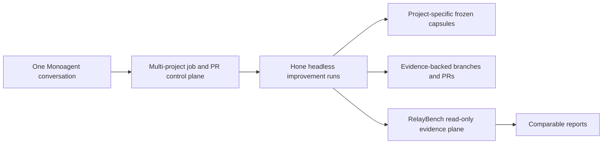
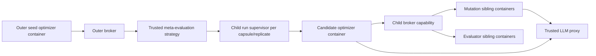
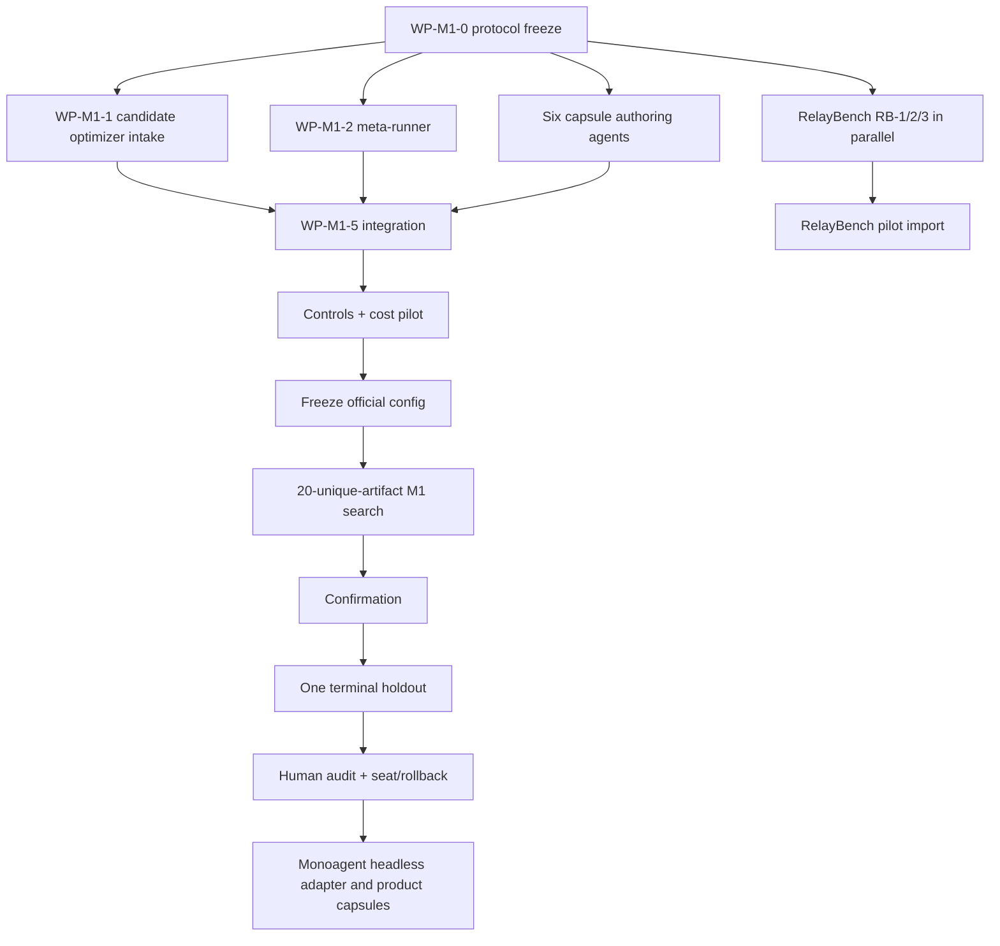

# Hone M1, RelayBench, and Monoagent Integration Plan
**Date:** 2026-07-15  
**Starting point:** M0 release commit `9f48cd1`  
**Scope:** prepare and run the first bounded `hone "hone"` campaign; build RelayBench’s evidence layer in parallel; use Monoagent as both one M1 target and the future multi-project control plane.
## 1. Executive decision
M1 is **not ready to launch from the current tree**. The reusable M0 kernel is real and hardened, but the M1-only pieces are absent: candidate-specific optimizer intake, trusted meta-evaluation, a five-train/two-holdout corpus, cross-capsule normalization, complete-run evidence, model identity/sentinel records, and optimizer seating/rollback.

The recommended sequence is:

1. Freeze one M1 protocol: **5 public train capsules + 2 frozen holdout capsules**, 20 unique optimizer source artifacts including seed, at most 40 outer non-seed mutation attempts, fixed `gpt-5.6-sol` routing, and every admitted artifact measured on all five train capsules.
  
2. Build the trusted meta-runner and candidate optimizer bundle path without weakening M0’s container boundary.
  
3. Admit six new owner-repository capsules and reuse `seeded-astar` as the fifth train capsule.
  
4. Run real broken/degraded optimizer controls and a cost pilot.
  
5. Freeze the final campaign configuration, then run M1 without adaptive changes.
  
6. Confirm the selected winner, access the two holdouts once, human-read the diff, and seat only a passing winner with one-command rollback.
  
7. Build RelayBench’s read-only protocol, ingester, statistics, and publication bundle in parallel, but treat M1 as a pilot—not an official leaderboard result.
  
8. Integrate Hone into Monoagent after the M1 runtime path exists. Monoagent becomes the operator/control plane; Hone remains the isolated improvement engine; RelayBench remains the evidence plane.
  

The M1 result may support a **directional, reversible operational promotion**. It may not be described as a powered corpus-wide causal effect, model improvement, general transfer, or recursive acceleration.
## 2. Monoagent: incorporate it, but do not merge the products
Monoagent and Hone are complementary:



- **Monoagent:** user interaction, project/job scheduling, PR inventory, approvals, and displaying status across tens of projects.
  
- **Hone:** sandboxed search, immutable task contracts, protected evaluators, hard resource budgets, candidate selection, and evidence-backed delivery.
  
- **RelayBench:** read-only comparison of complete Hone runs. It never launches agents, evaluates code, or participates in promotion.
  

This separation preserves Hone’s trust boundary. Monoagent should call the headless CLI as an external process and consume NDJSON; it should not import trusted Hone internals, receive evaluator assets, or gain CAS/broker authority.
### Immediate Monoagent use in M1

Use **Monoagent context retention** as one public-train capsule. `test/front/context.test.ts` already supplies deterministic in-memory SQLite state, an injected clock, a hard projection cap, current-input preservation, focused-effort retention, bounded project/effort/tail state, and a deterministic window hash.

The M1 evaluator must turn that correctness base into a sealed structured-utility scorer: weighted recall of valid unique source records under `maxWindowChars`, with hard constraints for an untruncated current instruction, persisted-input validation, focus retention, determinism, and the character cap. Search can improve ordering, reservation, serialization, and truncation policy without invoking a model. Hidden fixtures vary project priorities, record lengths, and distractors.

This is a real product objective against current Monoagent `main`, not merely recovery of a synthetic regression. A passing result can produce a better context assembler branch. The protocol validator remains a bounded reserve/calibration capsule if this scorer fails admission.

Do not use the entire Monoagent application as one capsule. A capsule is one bounded objective with one frozen scalar oracle. A large application should produce several capsules over time.

Monoagent already has useful benchmark publication concepts in `src/bench`: inner/outer selections, exact source/grader provenance, explicit `scored | not_run`, completeness checks, and a sealed harness revision. RelayBench should reuse or cleanly extract those publication concepts after an explicit license decision. It must not reuse Monoagent’s `parallelRatio`; that score divides by a potentially zero baseline and estimates a different quantity.
## 3. Decisions to review in Roughdraft
These are the recommended defaults. Changing one requires changing the protocol before implementation or launch.

| Decision | Recommended value | Reason |
|---|---|---|
| M1 corpus | 5 public train + 2 frozen holdout capsules | Resolves the current 3-versus-4/5 contradiction and preserves the written 80% sign gate. |
| Train tasks | `seeded-astar`, Trade-up offline profit, Monoagent context retention, FLT TextInput, expanded Agentelo scoring | Three open quality/performance searches plus two bounded calibration tasks across five distinct objective surfaces. |
| Holdout tasks | Trade-up query latency, FLT workflow parser | One continuous performance holdout plus one structurally different correctness holdout; both withheld from all outer feedback. |
| M1 model | Requested and executed route `gpt-5.6-sol` for both outer and inner mutation roles | The updated proxy listed the route and a live completion returned HTTP 200 with response model `gpt-5.6-sol`. Seed and candidates are re-baselined under the same route; M0’s GLM scores are not pooled. |
| Unique optimizer artifacts | 20, including seed | Satisfies the lower bound of the written 20–30 range; identity is the canonical candidate CAS tar digest, with its image-bound bundle digest registered separately. |
| Outer non-seed mutation attempts | At most 40 | Separately bounds invalid and duplicate generation attempts; satisfies `candidates - 1 <= candidateAttemptsMax <= 4 × candidates` without changing admitted search cardinality. |
| Inner search | Up to 8 episodes per capsule run | Satisfies the written 8–12 range at its conservative bound. |
| Search replication | One complete inner run per admitted unique artifact × train capsule | Every admitted artifact sees all five tasks. Repeating all 20 artifacts three times would roughly triple a result that still suffers winner’s curse. |
| Confirmation replication | Seed, winner, broken control, and degraded control each get 3 complete runs per train capsule | Supplies the existing promotion rule’s `k=3` evidence on the arms that can be seated or validate the harness. |
| Holdout replication | Seed and winner each get 3 complete runs per holdout capsule, in one terminal access phase | Uses the holdout once and supports only a bounded non-regression statement. |
| Private repositories | Monoagent and Trade-up capsules are internal-only | Ownership permits private internal use; `private: true` with no license does not permit public redistribution. |
| Public `spawnRun`/`queryCorpus` | Keep `NotImplemented` for M1 | The trusted meta-runner can compose child supervisors internally. Exposing general recursive authority is unnecessary and expands the attack surface. |
| Delivery | `apply: none` through selection and holdout; human-reviewed branch for the winner; no automatic seating | M1 is directional and the optimizer is load-bearing. |
| RelayBench status | Build protocol/tooling in parallel; M1 is a pilot fixture, not a leaderboard result | The analysis cannot be tuned on M1 and then claim M1 as independent confirmation. |
## 4. Current reusable kernel and current blockers
### Reuse without rebuilding
- Content-addressed capsule manifests and pre-run hash admission.
  
- Protected and ledger-gated holdout asset visibility.
  
- Canonical CAS artifacts and hardened tar validation.
  
- Containerized, unprivileged optimizer execution with no host repository, Docker socket, credentials, CAS, or holdout access.
  
- Mutation and evaluator sibling containers behind the trusted broker.
  
- Proxy-only model egress, token accounting, body hashes, and trace journals.
  
- Append-only run events, replay/resume, durable broker journals, and crash cleanup.
  
- Paired statistics, finite-`t` promotion gating, noise/MDE calculation, A–A tests, and negative-control support.
  
- Headless CLI, branch delivery, exact durable delivery receipts, and M0’s final security fixes.
  
### Launch blockers
1. `trusted/meta` does not exist.
  
2. Production intentionally caps mutation episodes at one in `trusted/cli/src/backends/local.ts`.
  
3. `prepareOptimizerRuntime()` recollects only the default repository snapshot; it cannot run a sealed candidate optimizer artifact.
  
4. Only `capsules/seeded-astar/manifest.json` is admitted.
  
5. Cross-capsule scoring currently averages arbitrary objective maps; no campaign scalarizer/scale is frozen.
  
6. Broken/degraded Hone candidates are not built or executed.
  
7. Model routing records a model label, not a provider snapshot/fingerprint or drift sentinel.
  
8. Delivery can create a branch, but there is no durable optimizer champion seat or one-command rollback.
  
9. Per-run budget evidence exists; campaign/candidate aggregation and child-run joins do not.
  
10. The written plan contradicts itself: three train capsules versus a 4/5 train sign-consistency gate.
  
## 5. Frozen M1 corpus contract
### 5.1 Corpus

| Partition | Capsule | Frozen scalar `q_i` | Baseline/reference construction | Search character |
|---|---|---|---|---|
| Train | `seeded-astar` | Existing trusted correctness/performance aggregate | Existing baseline; M0 winning artifact as the diagnostic improved reference | Open continuous algorithm/performance search. |
| Train | `tradeup-profit` | Top-K distinct valid-signature net profit, or fixed-precision profit recall, over sealed market snapshots | Current discovery baseline; independently authored improved diagnostic; KNN pricing protected | Open product search across candidate generation, pruning, ranking, and selection. Requires a sealed Linux/Postgres fixture and fixed-work protocol. |
| Train | `monoagent-context-retention` | Weighted recall of valid unique structured records under `maxWindowChars` | Current `FrontContextAssembler`; improved diagnostic must retain more registered utility at the same cap | Open structured-utility search over ordering, reservation, serialization, and truncation. No model call. |
| Train | FLT TextInput | Passed sealed cases / declared sealed cases; at least 41 existing cases plus hidden Unicode/escape/state variants | Seeded or historical partial editor; current correct implementation as reference | Bounded state-machine calibration. |
| Train | Expanded Agentelo scoring | Passed sealed cases / declared sealed cases across a sealed log/precedence bank, not only the 12 visible cases | Constant/partial classifier; current correct implementation as reference | Bounded classification/calibration across no-diff, infrastructure, precedence, and dedup behavior. |
| Holdout | `tradeup-query-latency` | Negative registered log-combination of p50/p95 latency under an identical response/quality hash | Current query path; independent faster diagnostic | Open continuous performance. Requires scaled fixed DB, cache-off contract, Linux CPU quota, fresh processes, and median-of-k. |
| Holdout | FLT workflow parser | Passed sealed cases / declared sealed cases across legacy, DAG, gate, reference, preset, and generated structural variants | Parse-only/partial validator; current implementation as reference | Bounded cross-domain structural transfer; force fresh `HOME` and seal YAML/preset assets. |

The three open train tasks are the M1 promotion target. The two bounded train tasks remain because an all-performance corpus makes control discrimination and failure diagnosis weaker.

The original `tradeup-search-latency` and `site-cold-start` ideas are deferred, not relabelled: no frozen search-latency oracle exists, and no site source/build entrypoint was found. `tradeup-query-latency` remains a target only after its fixed database and correctness-preserving benchmark are built. Agentelo Bradley–Terry and Monoagent protocol validation are bounded reserves, not silent substitutions.

### 5.2 Search-space admission

Task labels do not prove useful search space. Before the corpus hash freezes:

- A functional task needs at least 12 independently scored sealed cases across at least three behavior groups, `S(seed) <= 0.70`, `S(naive) <= 0.85`, `S(ref) = 1`, `S(ref)-S(seed) >= 0.30`, and `S(ref)-S(naive) >= 0.15`.
- An open-quality task needs a fixed work/capital cap, hard validity and protected-path gates, a precomputed feasible optimum or registered reference scale, `Q(ref) >= 0.90` of that feasible optimum, `Q(ref)-Q(seed) >= 0.20`, and `Q(ref)-Q(naive) >= 0.10`.
- A performance task runs on the pinned Linux host/quota with nine interleaved fresh-process samples. Require `MAD/median <= 5%` or an effect at least `3x` measured noise, reference median at least 15% faster, p95 no more than 5% worse, and an identical response/quality hash.
- Every open task must rank two independently constructed above-baseline diagnostics, not one privileged patch shape.
- Public-train tasks get three two-episode seed-optimizer pilots. At least one must yield a valid above-baseline candidate, while no task may reach the reference in all three. A task that is solved immediately or never yields measurable variation moves to conformance/reserve before the corpus freezes.
- Holdouts receive trusted diagnostic/noise runs only; no optimizer pilot and no bytes in the training context.

If any target task misses its gate, M1 pauses for evaluator/task repair. The immediate bounded fallback is documented—Trade-up selection, Monoagent protocol validation, and Agentelo Bradley–Terry—but it must be approved as a weaker bounded campaign, never substituted silently.

### 5.3 Normalization

For capsule `i`, freeze before any outer search:

- `q_i(E)`: one oriented scalar produced by the trusted evaluator;
- `q_i_fail`: the value for invalid output or a failed required constraint, normally `0`;
- `q_i(base)`: trusted baseline measurement;
- `q_i(ref)`: trusted reference measurement;
- `s_i = q_i(ref) - q_i(base)`, which must be strictly positive.

A complete inner Hone run `r` receives:

\[
Y_{ir}(o) = \frac{q_i(A_{ir}(o)) - q_i(base)}{s_i}
\]

Do not clip `Y`: regression remains negative and a result above the reference remains above one. Candidate optimizer fitness is the equal-weight mean of capsule means, not a pooled mean over test cases or seeds.

For test-count capsules, evaluators should emit one objective, `score = passed / declared`, plus case-level feedback. Required validity/constraints are checked before scalarization. The generic mean-of-objective-values fallback is prohibited in M1.

### 5.4 Admission gate for every new capsule
Each authoring work package must deliver:

1. pinned source commit/tree and exact target paths;
  
2. trusted frozen baseline snapshot or fault overlay;
  
3. frozen naive, baseline, reference, and intentionally broken artifacts;
  
4. immutable OCI image digest and lock/toolchain files;
  
5. protected evaluator and hidden assets outside candidate edit scope;
  
6. case-level oracle and one scalar `q_i`;
  
7. observed strict diagnostic ordering `broken < naive < baseline < improved`;
  
8. repeated stability evidence and no network/service dependency;
  
9. canonical manifest, content hashes, ordering report hash, and license/internal-use metadata;
  
10. a smoke run through the real broker, not merely the repository’s local test command.
  

Failure of any item rejects the capsule. Do not weaken the evaluator or silently replace a task to hit the count.
## 6. Trusted M1 architecture


Properties:

- The outer Hone run edits only the allowed optimizer source surface.
  
- Saving a candidate produces a canonical CAS artifact and digest.
  
- The outer broker’s trusted evaluation strategy—not an ordinary evaluator container—passes that candidate to `trusted/meta`.
  
- `trusted/meta` creates fresh child run directories and normal RunConfig contracts for each capsule/replicate.
  
- The candidate optimizer runs in the existing unprivileged optimizer container and receives only the child broker capability and proxy endpoint.
  
- Child mutation/evaluator containers remain siblings. There is no nested Docker and no Docker socket in mutable code.
  
- Ordinary capsule evaluators never gain meta-runner or broker authority.
  
- Every child run has a fixed budget slice. The parent reserves the sum of child caps before launch, so aggregate spend cannot exceed the campaign cap even if accounting is reconciled only after a child finishes.
  
- Maximum recursion depth is one for M1.
  
- General `spawnRun` and corpus discovery remain deferred to M2.
  
## 7. Implementation work packages
### WP-M1-0 — Freeze the meta-campaign contract
**Targets**

- New `schema/src/meta.ts` and exports/tests.
  
- `hone-build-plan.md` M1 count and claim corrections.
  
- A versioned campaign config fixture under trusted test fixtures.
  

**Implement**

Define `MetaCampaignConfigV1` with:

- outer objective and mutable optimizer path allowlist;
  
- seed optimizer source commit, canonical candidate CAS tar digest, and image-bound sealed bundle digest, plus trusted runtime digest;
  
- ordered train/holdout capsule digests;
  
- per-capsule `q_i`, `q_i_fail`, `q_i(base)`, `q_i(ref)`, and `s_i` provenance;
  
- requested model roles and model-observation policy;
  
- unique optimizer artifact count (including seed), the separately bounded maximum number of outer non-seed mutation attempts, and outer budget;
  
- inner episodes, per-child budget vector, search/confirmation replicate counts, concurrency, and measurement epoch policy;
  
- broken/degraded controls as exact canonical source-artifact + image-bound bundle-digest pairs, and deterministic tie-breaking;
  
- promotion rule and one terminal holdout phase;
  
- allowed claim string and protocol/analysis hashes.
  

**Tests**

Reject three-train configs, duplicate capsule digests, a capsule in two partitions, zero/negative scales, holdout in search coordinates, unpinned images/runtime, missing seed/control source or bundle identities, legacy control digest aliases, aliased controls, `candidateAttemptsMax < candidates - 1` or `candidateAttemptsMax > 4 × candidates`, mutable protected paths, nonpositive episodes/replicates, and budgets whose parent reservation is less than the sum of admitted child runs plus the separately capped outer slice.

**Exit**

One canonical config hash determines the complete official campaign. Resume accepts only that hash.
### WP-M1-1 — Candidate optimizer artifact intake
**Targets**

- `trusted/cli/src/optimizer-digest.ts`
  
- `trusted/cli/src/backends/optimizer-container.ts`
  
- `trusted/cli/src/types.ts`
  
- focused CLI/container tests
  

**Implement**

- Introduce a sealed optimizer source input: default allowlisted repository snapshot or candidate CAS artifact overlaid on the frozen seed snapshot.
  
- Validate the candidate canonical tar, reject paths outside the M1 mutable allowlist, and reject changes to package manifests, lockfiles, Docker/build contracts, broker client, entrypoint, tests, or trusted code.
  
- Hash the exact effective source bytes plus pinned build image into the optimizer digest.
  
- Feed captured candidate bytes into the existing networkless, frozen build container; never build a candidate-provided Dockerfile or run candidate package scripts.
  
- Preserve all current bundle inode/owner/hash seals and unprivileged runtime hardening.
  
- Remove `HONE_OPTIMIZER_CMD` from official meta runs; it remains a dev/test seam only.
  

**Tests**

- One changed prompt byte changes the digest and is what executes.
  
- Forbidden path, symlink, hardlink, case-collision, oversized file, or tar alias refuses before Docker create.
  
- Candidate source cannot inject a dependency/build script.
  
- Post-seal byte/inode/mode drift still refuses.
  
- Default M0 snapshot behavior remains byte-identical.
  

**Smoke**

Launch a candidate optimizer container against a stub broker; prove it can complete the broker protocol while `/repo`, run state, CAS, holdouts, host env, credentials, and Docker remain absent.
### WP-M1-2 — Trusted meta-runner and child-run supervisor
**Targets**

- New `trusted/meta` package.
  
- A trusted evaluation strategy seam in broker/CLI construction.
  
- CLI command `hone hone --campaign <path> --headless`.
  

**Implement**

For each candidate optimizer artifact:

1. run a cheap frozen conformance gate;
  
2. reserve all child budget slices;
  
3. create a fresh measurement epoch;
  
4. run the candidate optimizer on every train capsule at the registered search coordinates;
  
5. collect each child’s baseline, best artifact, final trusted evaluation, complete spend vector, status, event-log hash/cursor, proxy-trace hash, and optimizer digest;
  
6. calculate `Y_i` from frozen `q_i` and `s_i`;
  
7. return an ordinary `EvaluationRecord` to the outer optimizer with one `perExample` entry per capsule and an equal-weight `normalizedGain` objective;
  
8. store a durable candidate-to-child-run join sidecar.
  

The outer optimizer receives scores and textual feedback, not protected assets or holdout identities/content.

**Failure semantics**

- Build/conformance failure: invalid candidate, no expensive child runs.
  
- One child failure: candidate invalid unless the pre-registered missingness rule says otherwise; M1 default is fail closed.
  
- Budget exhaustion: child status `budget`, observed best still recorded, no unmetered retry.
  
- Infrastructure failure: explicit `not_run`, never score zero; resume may retry only from the durable pre-launch receipt and same measurement epoch.
  
- Candidate failure: no retry that grants extra model budget.
  

**Tests**

Use injected child supervisors to verify equal task weighting, invalid/missing behavior, reservation math, bounded concurrency, deterministic tie-breaking, no holdout calls, exact event-to-record joins, and crash-resume without duplicate completed child runs.

**Docker smoke**

Run seed and one deliberately modified optimizer through the real meta path on `seeded-astar` with two inner episodes. Confirm all containers are siblings, all model traffic is proxied, and cleanup leaves no Hone resources.
### WP-M1-3 — Fresh measurement domains, evidence, and aggregate budgets
**Targets**

- `trusted/meta` state/event files.
  
- Broker memo-key inputs.
  
- Proxy/model-observation record.
  

**Implement**

- Add a trusted `measurementEpoch`/full-run replicate identity to evaluation memoization. Cache may deduplicate within one child run; it must not turn a requested full-run replicate into replayed output from an earlier run.
  
- Persist one row per full child run with candidate digest, capsule digest, asset group, full-run seed, evaluation seeds, baseline/final artifact hashes, `q`, `Y`, cache status, run ID, event/evaluation/proxy references, and full resource caps/spend.
  
- Aggregate candidate resources by component; never replace the budget vector with one scalar.
  
- Record requested model ID, endpoint identity, response `model`, provider/system fingerprint when supplied, request policy, and a start/end sentinel result. If no provider attestation exists, label the model identity as an alias observation—not a snapshot.
  
- Hash the complete evidence index and analysis configuration.
  

**Tests**

- Same optimizer/capsule/seed under a new measurement epoch executes again.
  
- Resume of the same epoch reuses the durable completed child exactly once.
  
- Cached evaluator calls remain marked and cannot masquerade as full-run replicates.
  
- Candidate aggregate equals the sum of child records and parent reservation.
  
- Missing/changed provider identity quarantines rather than silently pools results.
  
### WP-M1-4 — Controls, promotion evidence, optimizer seat, and rollback
**Targets**

- `trusted/meta` control fixtures and promotion adapter.
  
- New trusted optimizer-seat state.
  
- CLI `hone optimizer status|seat|rollback` commands.
  

**Controls**

- **Broken:** builds and speaks the protocol but never produces an evaluated candidate.
  
- **Degraded:** a pre-registered no-history/no-feedback policy that can mutate but should underperform the seed.
  

Both controls register exact canonical candidate source-artifact + image-bound bundle-digest pairs and use the same train capsules, model, budgets, and confirmation replicates as the seed/winner.

**Seating**

- Promotion consumes only trusted candidate/seed/control rows.
  
- Seat receipt records old/new optimizer digest, source artifact/commit, promotion evidence hash, operator action, and timestamp.
  
- `rollback` atomically restores the prior sealed digest and appends a receipt; it never reconstructs from an ambient working tree.
  
- No automatic seating in M1.
  

**Tests**

Control discrimination, promotion refusal on missing rows/failed constraints/holdout misuse/model drift, atomic seat update, interrupted update recovery, exact rollback, and unchanged M0 branch delivery.
### WP-CAPS-1 through WP-CAPS-6 — Author the six owner-repository capsules

Run six independent authoring agents after WP-M1-0 freezes the shared manifest/scalar contract:

1. Trade-up offline-profit train capsule: sealed Linux/Postgres fixture, fixed work, protected KNN pricing, top-K valid-profit scalar.
2. Monoagent context-retention train capsule: immutable structured-record utility weights and hidden fixture bank.
3. FLT TextInput train capsule with hidden Unicode/escape/state cases.
4. Expanded Agentelo scoring train capsule with a sealed log/precedence bank beyond the 12 visible cases.
5. Trade-up query-latency holdout capsule: scaled fixed DB, cache-off response hash, Linux quota, fresh-process p50/p95.
6. FLT workflow-parser holdout capsule with sealed presets/templates and generated structural cases.

Each agent owns one new capsule directory only, runs no project-wide suites, and must deliver the admission artifacts in §5.4 plus the search-space evidence in §5.2. A separate reviewer verifies ordering, noise/headroom, response quality, and train/holdout visibility.

Private Monoagent and Trade-up source may be copied only into private/local capsule storage. Record an internal-use provenance statement; do not publish their source, tests, fixture database, or capsule bundle.
### WP-M1-5 — Corpus admission and meta-path preflight
**Run in order**

1. Re-admit `seeded-astar` under the M1 normalization and search-space rules.
2. Build and digest-pin all six new capsule images.
3. Run broken/naive/baseline/reference diagnostics through the real broker for every capsule.
4. Run §5.2 noise/headroom checks and the train-only two-episode seed pilots. Do not run an optimizer on holdouts.
5. Freeze the ordered corpus index, scalarizers, utility weights, fixture/response hashes, Linux hardware profile, and all content hashes.
6. Move holdout evaluator bundles to the ledger-gated location before any outer optimizer snapshot is built.
7. Run the broken and degraded optimizer controls on all five train capsules.
8. Run a two-candidate train-only meta smoke to prove end-to-end feedback and resume.
9. Run the seed optimizer once on all five train capsules with the intended eight-episode inner cap; use this only for resource calibration.

No official outer campaign starts until all target tasks pass, the final config freezes, and no holdout optimizer record exists.
## 8. Official M1 campaign protocol
### 8.1 Search
- Model route: exact enrolled `gpt-5.6-sol` observation for outer and inner mutation roles. Re-measure the M0 seed under this route; do not compare against its earlier GLM campaign score.
  
- Seed optimizer: M0 release digest derived from `9f48cd1`.
  
- Objective: **“Improve the mutation episode: prompts, reflective-context assembly, and parent/restart policy. Preserve the broker protocol, sandbox boundary, and frozen build contract.”**
  
- Mutable paths: optimizer prompts/context/policy, episode scheduling/parent-restart logic, and mutation worker behavior explicitly listed in the campaign config. Broker client, package/lock/build files, entrypoint, tests, schema, trusted code, and capsules are protected.
  
- Candidates: 20.
  
- Every candidate: all five train capsules, one complete child run per capsule, up to eight inner episodes, same child budget vector and concurrency.
  
- Candidate order and tie-breaking: pre-registered and deterministic.
  
- No 3-capsule screening funnel.
  
- No holdout access.
  
### 8.2 Confirmation
After search ranking is durably closed:

- seed, selected winner, broken control, and degraded control;
  
- all five train capsules;
  
- three complete full-run replicates per arm/capsule;
  
- same model observation and child budget caps;
  
- fresh measurement epochs;
  
- report all candidate search results and confirmation rows.
  

The confirmation interval is still post-selection and directional. It is not a campaign-wide 95% discovery claim.
### 8.3 Holdout
Only if confirmation, security review, and diff-read pass:

- compare seed and winner on both frozen holdout capsules;
  
- three complete runs per arm/capsule;
  
- one terminal holdout phase recorded by the lifetime ledger;
  
- do not return holdout feedback to the outer optimizer;
  
- any further adaptive reuse disqualifies these capsules as final holdouts.
  

Permitted statement: “No observed regression on these two frozen capsules under this exact protocol.”
### 8.4 Promotion
Seat only if all hold:

1. train paired improvement passes the frozen operational gate;
  
2. positive task sign on at least 4/5 train capsules;
  
3. both real controls rank below the seed/winner as pre-registered;
  
4. no holdout regression under the frozen rule;
  
5. all resource caps and model-identity checks pass;
  
6. winner diff is coherent and confined to the mutable surface;
  
7. a cross-family reviewer finds no boundary regression;
  
8. branch delivery reproduces the candidate digest;
  
9. rollback is demonstrated before seating.
  

Any failure means no seat. Publish the failure and preserve the seed optimizer.
## 9. Resource plan and cost gate

Run official performance measurements on one provisioned, pinned Linux host. macOS remains valid for integration smoke, but Docker Desktop VM variance is not part of the M1 performance oracle.
Use M0’s final inner envelope as the initial pilot envelope, subject to the cost pilot:

```text
maxTokens:                1,500,000 per child run
maxUsd:                   5 per child run
maxWallClockSec:          2,400 per child run
maxEvaluatorInvocations:  63 per child run
maxEpisodes:              8
child concurrency:        2
```

Nominal child-run counts:

| Stage | Calculation | Runs | Token-cap sum |
| --- | ---: | ---: | ---: |
| Search | 20 unique artifacts (seed included) × 5 train × 1 | 100 | 150M |
| Confirmation | 4 arms × 5 train × 3 | 60  | 90M |
| Holdout | 2 arms × 2 holdout × 3 | 12  | 18M |
| **Total** |     | **172** | **258M** |

The 172 child runs depend on admitted unique artifacts, not generation attempts. They exclude the separately budgeted outer mutation calls, whose official synthetic config cap is 40 non-seed attempts, as well as conformance/cost pilots. At concurrency two, the child wall-clock caps imply a worst-case 57.3 hours; caps are not forecasts.

The hardened M0 campaign observed 281,375 tokens and 173.602 seconds for a one-episode run. Linear extrapolation is not credible because context, repairs, early stops, caching, and provider throttling differ. The seed cost pilot must therefore record observed median and upper-tail resources before the final campaign cap is signed.

`maxUsd` is not an economic measurement until the `gpt-5.6-sol` route has a pinned pricing table; the current proxy probe established availability, not price. M1 reports tokens, wall clock, evaluator invocations, model requests, and optional USD only if pricing freezes before launch.

A three-replicate search for all 20 admitted unique artifacts would raise the search token cap from 150M to 450M without removing winner’s curse. That is why the recommended design spends replication on seed/winner/controls after all admitted artifacts have seen all five tasks.
## 10. RelayBench parallel track
### 10.1 Product boundary
Create RelayBench as a separate read-only repository or package. It consumes immutable Hone evidence bundles; it has no Docker, broker, model, evaluator, delivery, or promotion authority.

Build it in parallel against M0 and synthetic fixtures. Freeze RelayBench’s protocol and analysis revision before opening M1’s selected-winner/holdout results. M1 may be imported later as a pilot fixture, not as an official model ranking.
### 10.2 Factor definitions
Use unambiguous notation:

- `R`: fixed trusted runtime/evaluator/broker version;
  
- `g`: model that generated an optimizer artifact;
  
- `m`: model executed by that optimizer on target tasks;
  
- `o`: immutable optimizer artifact/digest;
  
- `u`: task-builder version, if studied;
  
- `b = (tokens, USD, wallClockSec, evaluatorInvocations)`: resource cap vector;
  
- `i`: capsule;
  
- `r`: distinct completed full-run replicate.
  

A model alias is not a snapshot. Require a weights digest or provider attestation when available; otherwise label results with the requested/returned model strings, endpoint policy, sentinel status, and the explicit limitation.
### 10.3 Primary outcomes
For registered `q_i`, `s_i`, and baseline artifact `A_i0`:

[ Y_{ir}(h) = \frac{q_i(A_{ir}(h)) - q_i(A_{i0})}{s_i} ]

[ \theta(h;D,b) = \frac{1}{|D|}\sum_i \bar{Y}_i(h) ]

[ \Delta(h_1,h_0;D,b) = \frac{1}{|D|}\sum_i\left(\bar{Y}_i(h_1)-\bar{Y}_i(h_0)\right) ]

Capsules—not seeds or test cases—are the independent units. For small frozen task sets, use the paired task-level finite-`t` interval and show every task delta. Use a hierarchical/task bootstrap only after a sufficiently broad corpus exists.

Named metrics:

- **ArtifactGain:** final artifact versus its frozen baseline for one system.
  
- **OptimizerLift:** `o1` versus `o0` at fixed `m,u,R,D,b`.
  
- **ModelLift:** `m1` versus `m0` at fixed `o,u,R,D,b`.
  
- **BuilderLift:** `u1` versus `u0` on one common test distribution at fixed `m,o,R,b`.
  
- **TransferLift:** optimizer contrast on a separately frozen future/domain-disjoint corpus.
  
- **RelayAcceleration:** additive change in successor-production gain across independent lineages.
  

Do not make `S_{t+1}/S_t` or gain/cost ratios primary. Zero, near-zero, or negative denominators make them undefined or unstable. A ratio may be descriptive only when the denominator’s pre-registered lower confidence bound exceeds `epsilon`; otherwise report `not_estimable`.
### 10.4 Benchmark tracks
1. **Ordinary optimization:** fixed `R,o,u`; compare models on artifact improvement under equal `b`.
  
2. **One-generation self-improvement:** model `g` produces `o_g`; evaluate `o_g` versus `o0` with the same execution model on untouched capsules.
  
3. **Model/optimizer transfer:** for models A and B, generate `o_A` and `o_B` under equal development budgets, then evaluate `{o_A,o_B}` with both execution models. The diagonal measures bounded “self” arms; off-diagonals reveal transfer and interaction.
  
4. **Task-builder attribution:** add `u0/u1` only with all eight `2 × 2 × 2` model/optimizer/builder cells, or label reported effects as conditional. Builders may create development tasks but all builders are judged on one common frozen test distribution.
  
5. **Multi-generation relay:** multiple independent lineages, fixed generation operator and development budgets, disjoint development cohorts, and embargoed future/test cohorts. Primary acceleration is additive: `A_t = mean_l(S_{t+1,l} - S_{t,l})`.
  
### 10.5 RelayBench v0 implementation packages
RB-1 — Protocol and ingester

- Validate treatment, capsule/oracle, model, runtime, optimizer, task-builder, budget, lineage, selection, and holdout identities.
  
- Verify content hashes and campaign protocol/analysis revisions.
  
- Join outer candidate rows to child run IDs, evaluator records, events, proxy traces, and ledgers through the explicit meta-runner sidecar.
  
- Preserve `not_run`, invalid, budget, and infrastructure states; never coerce them to zero or drop them.
  

RB-2 — Statistics

- Implement `Y`, `theta`, paired `Delta`, task-level finite-`t` intervals, sign consistency, complete-case/missingness reports, and pre-registered multiplicity families.
  
- Golden tests cover zero/negative baselines, invalid constraints, near-zero scales, missing arms, cached evaluations, repeated seeds that are not full runs, ratio non-estimability, and unequal budget refusal.
  

RB-3 — Publication and provenance

- Produce canonical JSON plus a human-readable report.
  
- Seal analysis code/config with a framed SHA-256 revision.
  
- Require exactly one expected result or explicit `not_run` for every planned cell.
  
- Include all candidate attempts, failed runs, human interventions, budget caps/spend, model observations, and holdout ledger evidence.
  

Monoagent’s existing publication code is good prior art. Because that repository is private and has no declared license, either keep reuse local, add an explicit license, or make a clean implementation from the published interface; do not silently copy it into a public RelayBench repository.

RB-4 — Pilot only

- Ingest the M0 seeded-A* baseline/winner and synthetic controls.
  
- Ingest the M1 dry-run evidence once the sidecar exists.
  
- Prove deterministic reports and deliberate refusal on tampered/missing evidence.
  
- Freeze RelayBench v0 before official M1 holdout access.
  
### 10.6 Official per-model benchmark prerequisites
Do not rank GPT, Opus, GLM, or another model until:

- exact endpoint/model observations and parameter policy are enrolled;
  
- a common redistributable test corpus is frozen independently of all compared models/builders;
  
- a multi-configuration pilot estimates candidate×capsule variance;
  
- `n` and full-run `k` are selected from the MDE target rather than convenience;
  
- the complete 2×2 model/optimizer crossover is affordable;
  
- all arms receive identical capsule bytes, evaluator seeds, concurrency, and budget-vector caps;
  
- pricing is either pinned or omitted from economic claims;
  
- analysis and task hashes are frozen before results.
  

M1’s five train capsules and two holdouts are intentionally too small for a general model leaderboard.
## 11. Monoagent integration after the M1 runtime exists
### 11.1 Headless Hone adapter
Add one external-process adapter in Monoagent:

- input: repository, capsule ID/path, objective, exact run config, budget, and delivery mode;
  
- launch `hone run`/`hone hone` with argv arrays, never shell interpolation;
  
- parse only versioned NDJSON from stdout;
  
- persist run ID, campaign/config hash, event cursor, best artifact, spend, and evidence links;
  
- expose start/stop/status/best/diff/approve-branch actions in the single agent conversation;
  
- never mount or read Hone holdouts, admin sockets, CAS internals, upstream credentials, or Docker.
  

Monoagent may schedule many jobs, but a trusted global admission layer must cap concurrent Hone runs and provider usage. RelayBench comparisons must record concurrency and exclude runs launched under a different resource policy.
### 11.2 Continuous capsule harvesting
Monoagent’s multi-project PR history can become Hone’s long-term corpus:

1. take a completed task’s objective and pre-fix commit;
  
2. use the merged patch as an ordering/reference artifact, never expose it to mutation;
  
3. seal mechanical tests/oracles and exact environment;
  
4. construct broken/naive/baseline/reference diagnostics;
  
5. require human capsule admission;
  
6. assign temporal partitions so later PRs remain untouched holdouts.
  

This is the scalable path to improving all owner projects. Capsule creation remains a trusted/offline authoring action; Monoagent does not automatically declare its own work a valid benchmark.
### 11.3 Genuine Monoagent improvement capsules

M1’s context-retention capsule is the first genuine Monoagent product objective: current `main` is the baseline and the frozen scorer rewards more relevant structured state under the same context cap.

Follow-on capsules:

- protocol robustness against new adversarial inputs;
- Rust TUI state/render/reconnect behavior;
- queue/scheduler fairness and crash recovery through deterministic simulation;
- routing/context/prompt policy evaluated by Monoagent’s frozen task corpus.

The last item invokes coding agents and therefore uses the trusted meta-runner pattern, not an ordinary evaluator container with credentials.

### 11.4 Trade-up-bot profit capsule

`tradeup-profit` is an M1 target because it can improve the current product rather than merely repair a seeded regression. Admission must first replace the existing nonempty/determinism assertions with a real quality oracle:

- frozen, scaled market snapshots with fixed seeds and a sealed local PostgreSQL image;
- top-K distinct valid-signature net profit or fixed-precision profit recall;
- fees, liquidity, slippage, capital, inventory, and risk constraints;
- hard validity: ten inputs, positive net profit, no duplicate signatures, required condition/E2/three-collection behavior, deterministic output;
- protected KNN-pricing hash;
- fixed work rather than a movable `Date.now()+60s` deadline;
- temporal/structural fixture holdouts never used for strategy selection;
- no live API, account, production URL, external database, Redis, or credentials;
- branch-only delivery and human backtest review; never automatic live deployment.

The separate query-latency holdout rejects faster-but-wrong results through an exact response/quality hash. Together these tasks can improve Trade-up profit and speed without allowing Hone to optimize against current market noise or real funds.
## 12. Parallel execution map


Recommended agent wave after protocol freeze:

- 2 agents on candidate runtime/meta-runner seams, coordinated through an agreed interface;
  
- 6 agents, one per owner capsule;
  
- 1 reviewer on capsule visibility/order evidence;
  
- 3 agents on RelayBench protocol, statistics, and publication;
  
- Main owns integration, cost protocol, campaign launch/monitoring, final diff-read, and claim language.
  

No agent independently changes shared schema after WP-M1-0. Integration tests and project-wide checks run once after the wave, not in every agent.
## 13. Verification and release gates
### Runtime verification
- Package tests and workspace TypeScript are green.
  
- Candidate source and bundle hardening regressions are green.
  
- Meta-runner unit tests prove reservation, weighting, resume, missingness, and measurement epochs.
  
- Real Docker smoke proves candidate optimizer isolation and sibling topology.
  
- Fault-injected crash/restart leaves no duplicate child runs or Docker resources.
  
- Proxy traces contain every model request/response body hash and aggregate spend reconciles.
  
### Corpus verification
- Seven manifests and ordering reports validate from fresh checkout/state.
  
- Every image is digest-pinned and locally available without pull.
  
- Every evaluator is deterministic enough for its registered rule.
  
- Train and holdout path sets are disjoint and holdout reads are zero before the terminal phase.
  
- Private source never appears in a public RelayBench artifact.
  
### Campaign verification
- All 20 admitted unique artifacts have one row for every train capsule or an explicit terminal invalid/not-run state; outer generation attempts, including duplicates and invalid outputs, are recorded separately and never inflate that cardinality.
  
- Search ranking is closed before confirmation.
  
- Seed/winner/controls have three full-run replicates; cached evaluator replays are not counted as replicates.
  
- Holdout ledger shows exactly the pre-registered terminal accesses.
  
- Winner branch bytes reproduce the selected optimizer digest.
  
- Rollback restores the exact M0 seed seat.
  
### Final conformance audit
A separate cross-family reviewer reads:

- every M1 requirement in `hone-build-plan.md` and the RFC review;
  
- the frozen campaign config and corpus index;
  
- candidate/child evidence joins;
  
- security boundary changes;
  
- winner diff and delivery/seat receipts;
  
- RelayBench’s claim output.
  

The final report lists PASS, FAIL, ACCEPTED RISK, or DEFERRED M2 for every line. No documentation-only disposition may close a behavioral requirement.
## 14. Exact M1 success and failure language
### If all gates pass
> With the recorded `gpt-5.6-sol` route observation, trusted runtime, five public train capsules, fixed child budgets, and two terminal holdouts, one selected mutable optimizer candidate showed a directional paired sign pattern on at least four train capsules, ranked the pre-registered broken/degraded controls below the seed, had an interpretable confined diff, and showed no observed regression on the two frozen holdouts. It was seated reversibly.

This does not claim a population-average effect, a model update, general optimizer transfer, or recursive acceleration.
### If any gate fails
> M1 did not seat a new optimizer. The run established which protocol, runtime, corpus, discrimination, resource, security, or holdout gate failed; the M0 optimizer remains champion and the complete evidence is retained.

A clean failed campaign is useful evidence. Relaxing a frozen gate after seeing results is not.
